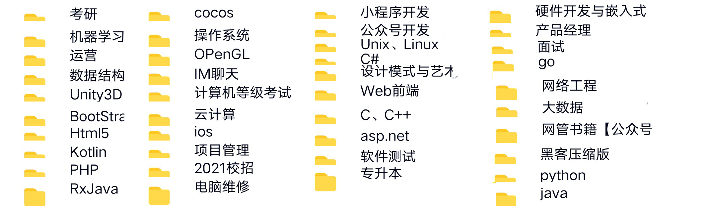
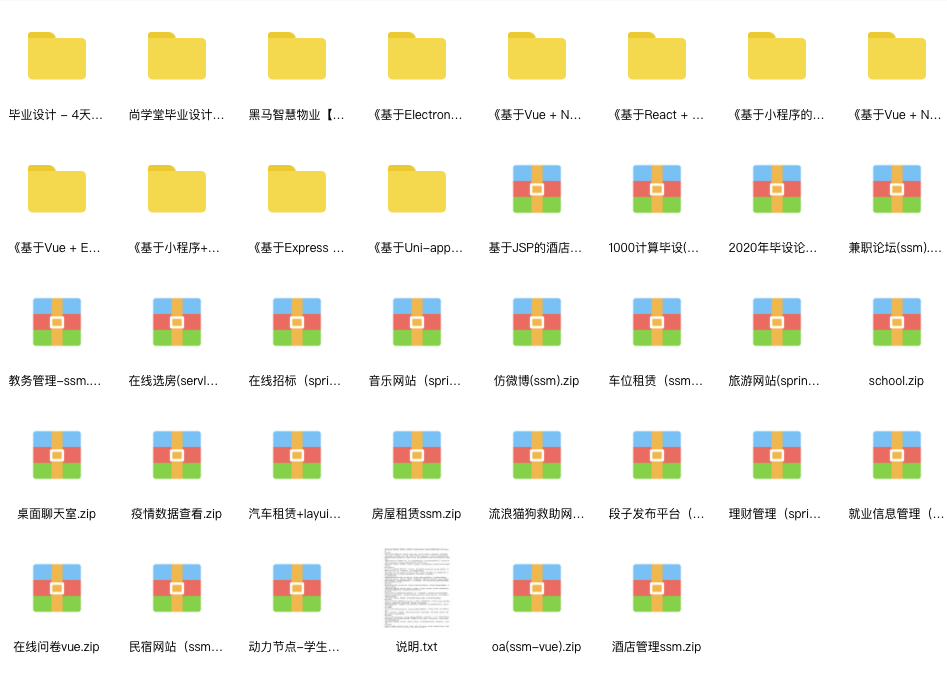

# 逆天改命——启舰的一百条程序员人生建议

大家好，我是启舰

唬人的头衔比较多，我出过两本技术书籍《Android自定义控件入门与实战》、《Android自定义控件高级进阶与精彩实例》，2017度CSDN博客之星，CSDN博客专家，电子工业出版社优秀作家。

现在从业近十年，硕士毕业后进了阿里，现在辗转几个大厂，做了几年的技术主管。

**做公众号一年多以来，看到一些同学还在重蹈着我的覆辙。也有些同学，努力的让人心疼，但方向不对，也终是徒劳。**

所以，但凡遇到向我提问的同学，我有空的时候，都会细心做答。但毕竟精力有限，在我忙起来的时候，一些提问根本没有精力细细回复。

我尝试把我以前的文章进行归类，希望大家通过检索的方式，在我以前的文章中找到答案。但文章毕竟繁琐冗长，一些问题并没有明确的答案。

**我决定把文章重新编纂，把编程领域相关的问题一一作答。**

我一直在想，如果在我年轻时拿到这本书，我的人生或许会不一样。但千金难买早知道。我的人生浪费了很多时间，走了很多弯路。

**这本书是我近十年所知所会的心血结晶，希望你能够仔细阅读，我觉得它应该能改变很多程序员的命运。**

基于此，我给他取了一个带着使命的名字《逆天改命——启舰的100条程序员人生建议》

这本书，本是出版社约稿。

目前来讲，出书对我的意义不大，我更想让这本书广泛传播，以帮助更多的同学，所以，我决定以电子书的形式，把这本书分享给大家。

**我希望这本书这本书是程序员人生路上的百科宝典，它其中将涉及校招、社招、入门、进阶、笔试、面试、转行、副业、青春饭等等问题，涵盖程序员相关的方方面面。随着人生阅历的增加，我可能会及时增加其中的内容。**

**本书中所有内容都是我的经验所得，但毕竟个人的经历和眼界都是有限的，如有不对之处，还请不吝赐教。**

**其实，我也就一普通人，想必看这本书的很多同学，以后都会比我强。**

要说我有什么本事，只不过是喜欢总结和分享罢了。

**我单纯的只是希望我知道的这点东西能够帮到一些同学，如果有一天，你发现我说的是对的，甚至我真的有帮到你，那这本书的使命就完成了。如果还能再跑回来跟我道声谢，那就真的太让我开心了。**

**书中所有文字，皆为原创。与版权公司有合作，抄袭必究。**

花有重开日，人无再少年。

希望大家都能够珍惜当下，不要让未来的你，讨厌现在的自己。

**原创不易，如果有帮到你，请帮我点个star吧，比心，biu~biu~biu~**

## 二、目录

* [开篇](README.md)

* [大学生篇](part1.md)

  * [1.对计算机专业来说学历真的重要吗？](content/advice_1.md)

  * [2.计算机专业有必要考研吗？](content/advice_2.md)

  * [3.计算机考研，这样选学校才是正解](content/advice_3.md)

  * [4.程序员垃圾简历长什么样？](content/advice_5.md)

  * [5.我为什么推荐学Python，但不希望大家用Python找工作？](content/advice_6.md)

  * [6.计算机专业如何高质量的走完大学四年?毕业成为Offer收割机](content/advice_7.md)

  * [7.程序员是做全栈工程师好？还是专注一个领域好？](content/advice_8.md)

  * [8.如何系统地学习计算机编程？自学还是培训？怎么选？](content/advice_9.md)

    

- 社招篇

  - [1.在中国，程序员前景一片灰暗？](content/advice_31.md)

  - [2.计算机基础知识对程序员来说有多重要？](content/advice_32.md)

  - [3.在中国程序员是青春饭吗？](content/advice_33.md)

  - [4.程序员的五层境界，你在哪一层？最后一层的，都是人生赢家](content/advice_34.md)

    

- 副业挣钱

  - [1.什么才是创业必胜的真经？](content/advice_51.md)

  - [2.在校大学生如何用编程赚钱？| 我的大学赚钱之路](content/advice_4.md)

  - [3.今年大三，兼职年入六万，方法路径分享](content/advice_52.md)

  - [4.读者牛逼！接澳洲的单子，一天600，方法路径分享！](content/advice_53.md)

    

- 我的故事

  - [1.再见，我考上了！](content/advice_91.md)

持续连载中……每周两篇……

## 三、这里都可以找到我

欢迎大家关注我的公众号，本书所有内容，公众号均为首发，另外还有更多精彩内容，相信你会喜欢。

同时，如果你对本书中问题有疑问和建议，亦或书中还有没涉及的问题点，可以加我微信详细交流，好友位有限，先到先得。

## 四、公众号资源汇总

在我的公众号上，我收集了很多资源，有需要的小伙伴可以直接去领取。

#### 1、各方面入门、进阶、实战视频资料&电子书

**我精心整理了计算机各个方向的从入门、进阶、实战的视频课程和电子书，都是技术学习路上必备的经验，跟着视频学习是进步最快的，而且所有课程都有源码，直接跟着去学！！！**

**视频内容非常多，总共2184G、一千六百多册电子书，九百多套视频教程，涉及43个方向。我整理了很长时间，有些资料是靠买的，希望大家能最快的提升自己。**

**在可以扫描下方二维码，也可以在微信搜索公众号【启舰杂谈】，回复『211』，即可获取**。没有任何套路，大家放心下载

#### 2、考研

有学弟学妹问我要考研学习资料，那把我去年给我弟整理的资料分享给大家，不仅包含本文所涉及的各种图表，考研培训班视频、历年考题、各高校的历年面试题、报考锦囊等等，资料很全。

**我弟去年上岸就是靠的这些资料，绝不是网上随意打包的那种，有的都是靠买的，绝都是自己考研时候用的，最后汇总而成，内容非常干。**

对于考研的同学，同样可以扫描上方二维码，回复『 **212** 』，即可获得我整理的考研培训班视频、历年考题、各高校的历年面试题、报考锦囊等等

#### 3、2300套建站源码

对于需要靠建站接单的同学，这里把我当时收集的2300套建站源码分享给大家，有需要的拿去用吧。这回得star了吧~~~

需要的小伙伴可以去下载，可以扫描上方公众号二维码，回复『 **213** 』，即可获得。没有任何套路。

### 4、毕业设计

我把我断断续续收集的两百套毕设工程源文件送给大家，可以去领。

琢磨透，就能开始赚钱了。

无论自己用还是代做毕设，又或者做为项目经验写进简历都是不错的选择。

**扫描上方二维码，回复『 226  』，即可获取**。没有任何套路，大家放心下载

