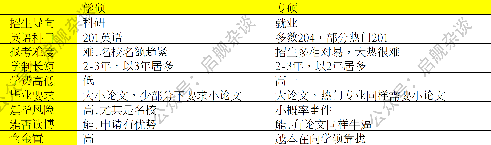
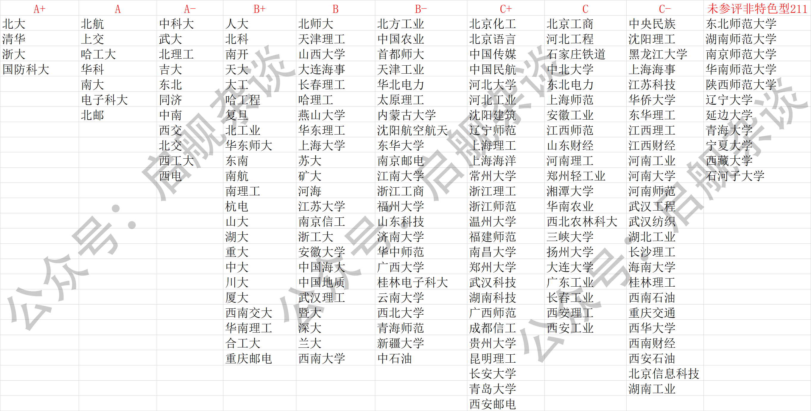
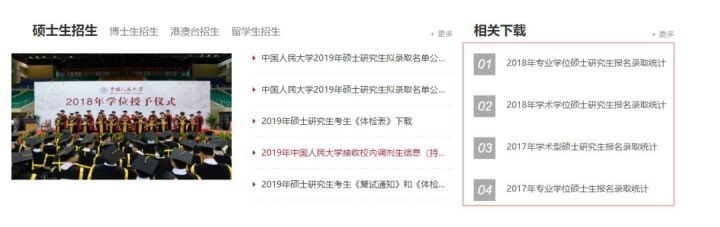
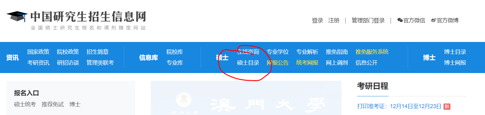
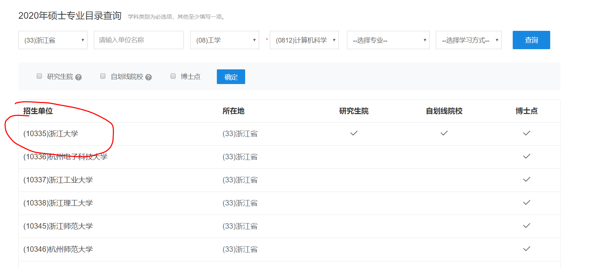
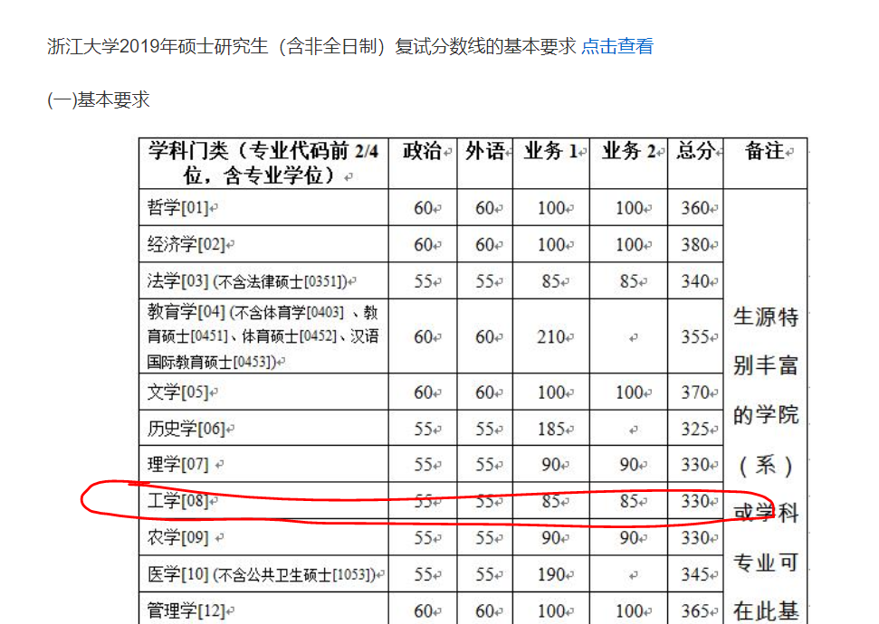

# 计算机考研，这样选学校才是正解

>  合抱之木，生于毫末；
>
>  九层之台，起于累土；
>
>  千里之行，始于足下。
>
>  ——《老子》

**根据自身经验加之搜遍全网，将其整合，方有此篇。我敢说，看完此篇，全网再无攻略。**

报考学校选择绝对是整个考研过程中第一重要的事情，考研的目的，不是考分高，而是考得上！！！

太多的同学高分落榜，而其他同学低分上岸，这样的案例数不胜数。“方向不对，努力报废”这句话用来形容没有选好报考学校的重要性再合适不过了。

当年我考研时，国考408考了342分，国家线是315，80%的985/211都过线了。但我却选择的是中科院软件所。差一分没过线。因为本科是渣渣二本，调剂无门。虽最终在同学帮助下进入中国海洋大学，但就我自己调剂而言，那基本上就是落榜了。

**所以，千万不要用你的勤奋来掩饰战略上的懒惰！！！！报考学校，值得你好好研究！！！！**

**文末，也帮大家整理了考研复习的各种视频资料、历年真题、报考指南等资源，近500G，免费送给大家。**

**目录：**

- 报考学校有哪些必知秘密
- 螺旋报考，降低风险
- 高校排名与分布情况
- 研究报录比、大小年走向，最终确定志愿
- 一些建议

## 一、报考学校有哪些必知的秘密

### 1、全日制vs非全日制

非全日志研究生能继续上班挣钱又能有工作经验还能参加校招，感觉比读全日制还强。

但事实是，非全在一些企业是受歧视的。最大的优势在于能参加校招，对于不歧视的企业而言，非全的同学有研究生学历又有工作经验，这对于全日制同学绝对是碾压性优势。**为此，上海已经不允许非全同学参加校招了。**

而对于强学历要求的岗位，比如事业单位，建议大家还是考全日制。

### 2、学硕vs专硕

专硕分数相对较低，但由于在校年限短，有些导师不招专硕学生，导致专硕名额相对学硕少。后面会教大家如何看某学校的招生人数，这点不必担心。

很多同学担心专硕学位在就业时有歧视。

我参与校招、社招这么多年，**在企业招聘中，学硕和专硕绝对是一视同仁的。**

**在不太坚定读学硕搞科研的前提下，建议读个年限短好毕业的专硕，性价比很高**

**但需要注意的是学硕和专硕培养方式不同，如果就业为主，学硕、专硕都可以考，如果想读博、做研究、大学当老师，那还是要报考学硕。**

### 3、必须要知道的地域优势

**在北上广深和省会地区的学校，你以为单纯的是个学校这么简单？**

在大城市的高校，无论就业还是实习，机会都非常多，而且这些城市一般都会有各个大公司的分部，而犄角旮旯的地区，别说大公司分部，能有几个像样的企业就不错了。

尤其是想要考二本研究生的同学，更要重视这一条！！！！**地域优势，对二本研究生来说，那简直就是救命稻草……**

一般而言，二本、三本、专科的同学在校招时，人家基本上连简历都不会看的。但如果你这个学校是本地的二本，人家知道，情况就是另外一种。而且，本地有大公司分部的情况下，二本的同学可以通过实习的方式进入大公司，并最终转正。

杭州有个浙江理工大学科艺学院，其实是挂了浙江理工大学名字的三本学校。但它的位置非常好，在阿里对面。这里的学生，每年都有进阿里实习并转正的。而其它的二本、三本学校的同学连简历都进不来。

**地域优势，无论对实习、就业还是学习时兼职，都非常重要！！！**

## 二、螺旋报考，降低风险

**年轻时，我信奉有理想就去拼，哪管它天高地厚。上了年纪，凡事我更讲究性价比。**

你可以像我一样，从一个广西渣渣二本直接报考中科院软件所，中科院是我们学校自建校以来都没人敢报的学校。你可能会成为神话，但更容易跌落神坛！！！后来才知道，人家中科院根本不要二本毕业的学生！！！

**对整个社会的无知，会使你所有努力白费。**

**如果你有自己坚定的梦想，全当我下面这块说的是放P。我支持有梦想的同学，也喜欢和尊重有梦想的同学。我想对你说的是：加油，拼尽自己的一切，无悔就好。**

如果你想保险一点，请参考我下面的建议：

**计算机院校是分三六九等的。大致分为六级**

- 第一级：清北、中科院强所、强985优势专业
- 第二级：强985高校、普通985但强势专业、211特色强校
- 第三级：普通985高校、211优势专业、普通特色强校
- 第四级：普通211、一本强校
- 第五级：普通一本、二本强势专业
- 第六级：普通二本、三本院校

**在这些划分中具体有哪些学校，后续将会给出**。

可以看到大致的分级策略很简单，就是学校好就直接高一档，985>=211>=一本>=二本，能让你在当前等级上能否提一级的，是看你的专业是不是强势专业。也就是211高校强势专业等于普通985。

**所以，大家根据自己当前的学校等级遵循螺旋式上升报考即可。**

**即当前在第三级，最保险的是平级读研，如果报考第二级，颠颠脚够得着，如果报考一级，需要加倍努力，建议大家最高跳两级。**

虽然知乎上每年都有二本考上武大，三个月双非上清华，在职半年复习考复旦这类激动人心的标题，但是一定要冷静分析，统计学上概率低于5%的叫不可能事件，希望大家明白。

## 三、高校排名及分布情况

### 1、名校分布

前面，我们提到了地域优势，这里先列出一张全国名牌高校地域分布图，供你参考：

（文末付高清版下载地址）

说明一下：图中高校分布是按照省份进行划分，标记方法如下：

**这张图，大家可以保存下来，在择校时候，不用特地百度这个院校的百科了**（适合对985/211高校不能全面了解的孩纸）。

### 2、高校排名

上面的地图列出了985/211/双一流等名校地域分布，从上面的图中，你也可以明显看出985、211、双一流学校都有哪些

**在螺旋式报考高校划分时，我们是将学校等级和专业优势结合起来进行划分的，下面就是再来分析专业排名。**

**至于专业是不是强，国家已经给过明确答案，就是第四次全国高校学科评估结果：**

这时候，再结合螺旋式高校梯度划分，就可以知道，在螺旋式各个等级中，分别包含如下高校。

**第一级：清北、中科院强所、强985优势专业**

就是A+列高校+中科院

**第二级：强985高校、普通985但强势专业、211特色强校**

对应A、A-列高校

**第三级：普通985高校、211优势专业、普通特色强校**

对应B+、B列高校

**第四级：普通211、一本强校**

对应B-、C+列高校

**第五级：普通一本、二本强势专业**

对应C、C-、未参评特色211高校

**第六级：普通二本、三本院校**

不建议考，普通二本类研究生，真的没太大意义，这个学历并不能为你增彩多少，反而浪费了三年。

需要注意的是，在学校评估里有些并不是211高校的学校，但专业评分很高的学校，也都是值得去读的。这类学校有南邮、西邮、重邮、杭电等高校

## 四、研究报录比

经过上面的螺旋式报考和一些考试建议，相信你最终会把眼落在几个特定的学校上。那怎么从这些学校里，最终确定报哪个呢？这里告诉你。

首先，报录比是什么？

**报录比 = 报考人数：录取人数**

如果一个专业考了6个人，录取2个人，那么报录比就是3：1。

对于备考2020来说，在确定考研目标院校时，报录比的查询是必不可少的数据分析工作。例如，在两所目标院校实力相当，自己无法取舍的时候，选择报录比较小的院校是明智的选择。这样不会因为报考人数太多导致录取分数节节攀高，避免自己成为考研的牺牲品。

就算是心中已经有了明确的目标院校的同学，做好报录比查询也能给自己带来不少益处，如果报录比过高，就得提醒自己考研路上不要松懈，如果报录比较低，则让自己不要背负太大心理压力，安心准备就阔以啦。

**报录比获取方法有如下四种：**

### 1、目标院校的研究生招生网

幸运的话可以在目标院校研究生院看到各专业的报录比，自然是得来全不费工夫，比如中国人民大学都公布了具体报录比。

**中国人民大学研究生招生网**

**对外经济贸易大学研究生院**

你可以百度输入XX大学研招办，查看自己院校的具体情况!

但如果很不幸，没有报录比的信息，那就得学会分析官网有限的数据。虽然报考院校不会将历年的详尽数据全部公开，但录取人数一般是会公布的。

如果没有公布录取人数，你可以找一下拟录取的名单，根据该院校专业复试名单和最终的录取名单来算出一个大致的报录比，然后再结合院校当年的全部录取人数，基本可以估出这个院校的报录人数了。

### 2、中国研究生招生信息网

（1）、进入研招网，点击硕士目录([https://yz.chsi.com.cn/](https://link.zhihu.com/?target=https%3A//yz.chsi.com.cn/))

（2）、进入搜索页面，学科类别是必填项，其它项如果不知道，可以不填，会自动进行模糊搜索。

比如下面，我搜索了浙江省有计算机科学与技术的招研究生的高校

（3）、结果如下，点击目标高校，比如浙大

（4）、点击拟招生人数和考试范围

在拟招人数中可以看到今年这个专业总共招多少人（浙大计算机科学与技术今年招收33人）

在考试范围中，可以看到这个专业初试都考啥

（5）、结合去看复试分数线，预估今年难度

同样在研招网中可以找到，不过我地址给你找好了：[2019年考研分数查询及复试分数线汇总_中国研究生招生信息网](https://link.zhihu.com/?target=https%3A//yz.chsi.com.cn/yzzt/kyfs2019/):https://link.zhihu.com/?target=https%3A//yz.chsi.com.cn/yzzt/kyfs2019

这里列出了历年各个高校的复试分数线，从2015-2019年的，点击具体年份即可看到，比如，我们点击浙江大学的：

比如，我们计算机应用技术是工学类目，他2019年的各科及总结如上所示，你的分数过了这个线，就表示通过了。

### 三、网络找前辈

善于利用网络人脉，找目标院校专业的学长学姐打听，学长学姐在研究生入学的时候肯定也打听过自己当时是踏着多少人的“尸体”进入院校学习的。

现在网络社交如此发达，找到目标院校的学长学姐还是方便的，可以去目标院校的贴吧，QQ群寻找，既可以找群里热心的学长学姐帮忙，也可以和同期考研的网友互通有无。

### 四、打研招办电话

最后，是一个笨却有效的方法，当然是在官网没公布报录信息的情况下，官网有公布你还打电话，那不显得你傻了嘛。不要觉得不好意思，老师不知道你是谁，隔着电话咬不到你的。

去目标院校的研究生官网查到研招办的联系电话，然后一个个去打电话咨询，当然切记打电话一定要在上班时间，然后要有礼貌，无论老师有没有解答你的问题，都要说谢谢哦！

### 总结：最终确定志愿

考研大小年指的是如果上一年度的复试分数线较高，就会造成下一年度报考人数的变化，会使下一年度报考人数变少，从而使下一年度复试分数线降低。

反之如果上一年度的复试分数线较低，就会造成下一年度报考人数的变化，会使下一年度报考人数变多，从而使下一年度复试分数线提高，合称俗称大小年。

**通过历年分数线对比，即可分析出该校初试线的大小年走向。结合报录比，最终确定报哪个学校。**

## **五、一些建议**

### 1、在能力有限的前提下，建议优先选学校，而后顾专业，好学校≥好导师≥好专业。**

过来人经验告诉你，学校比专业重要，只要是计算大类中的专业，只要有项目经验都不会受歧视。并不是说，你学的专业是网络安全，你就必须从事安全类的工作。如果做程序员就会受歧视。**并不存在的！！！！用人单位筛人只有两个标准，第一：学校，第二：是不是学计算机的，仅此而已。**

### 2、有些高校口碑不好，尽量避开**

2018年西南某大学泄题事件（[《西南某大学泄题后续：500余考生已重考，多名老师被调查》](https://link.zhihu.com/?target=https%3A//www.sohu.com/a/289094034_114988):https://link.zhihu.com/?target=https%3A//www.sohu.com/a/289094034_114988），你知道吗？导致500多名考生重考。试想，如果事件没被发现，多少人当炮灰？多少人一年的努力付诸东流？

然而这都是冰山一角，漏出于水面的始终只有一小部分，大部分的黑暗是看不到的。

**你觉得考研公平吗？实话告诉你，只有高考才是绝对的公平。**

考研？保送的怎么说，复试内定的怎么说？复试题提前告密的怎么说？国家监管的只有初试，只要初试过了，复试？一切由人定而已。

**我们怎么办呢？多看看前人的经验，避开那些全网都黑的学校。**

在知乎上两个话题，很多人回答，自己去看吧。

《考研学校有哪些名声不好的大学？》：https://www.zhihu.com/question/317115184

《考研学校有哪些名声好的大学？》：https://www.zhihu.com/question/318976760

### 3、跨考、二战、非一本同学尽量求稳

对于跨考的同学而言，本身计算机知识缺乏，并不占优势，即便初试过了，复试也会受些歧视。有关复试如何复习的问题，后面会有文章再讲。如果初试没过，想走调剂？那可就难上加难了。如果本科学校就是211/985的话，尽量选择本校报考，复试前，通过认识的同学介绍下导师，都一个学校的，很好操作。

总之，建议跨考同学求稳，建议本校了考或平级报考。

对于二战同学而言，压力较大，也建议求稳，如果此次再失利，想必也不可能再考研了。如果一战时因为复试被刷，建议择校时避开原学校，除非你非它不上，能承担失败的风险。

对于非一本同学而言，尽量报考普通一本或普通211类高校为主，相对容易报考，毕竟咱们学历是会被歧视的。

### 4、要学会利用资源，主动向已经上岸的学长、学姐示好

每个学校每年都会有考上的学长学姐，看看他们去哪了，有没有你想去的学校，向人家了解下情况。而且如果初试过了，可以在复试前让他把你推荐给他的导师，可能，你就是被内定的那一个。

**考研不光靠的是努力，信息战同样重要，最忌讳的就是闭门造车，要埋头拉车、更要抬头看路。**

### 5、招生人数少于5人的专业一定要慎报

对于招生人数少于5人的专业，一定要仔细研究他的历年报录比，慎重报考，本来录的人不多，再加上些内定的，可能根本就已经没有名额了。你的牛逼分数很可能沦为鸡肋。

### 6、报考时，报一个保底的，报一个理想的

考研有两个阶段，第一阶段在报考学校时，是可以同时报两个学校的。但在临考前，会让你确定学校，此时只能确定一个，这个学校就是你最终报考的学校。

建议在报考学校时，选一个保底的学校，选择一个理想的学校。最后在确定时，根据自己当时的复习情况来具体确定，实在不行，也不至于一年努力白费。

保底的学校建议根据螺旋报考法中选择本校、平级学校报考。理想学校根据个人意愿而定，同样建议最多不要跨两级。

**但年轻人总是要有梦想的，传奇也总是需要有人缔造的，我的所有策略不过是保全之法，在梦想面前狗屁不是，有梦就大胆去追吧。**

## 六、资料下载 

自从这篇文章在知乎上火了以后，经常会有同学问我考研要怎么复习，有没有什么资料。

说实话，我大学时的很多课程也学的不怎么样，在复习第一遍时，自己看书，根本看不懂。

后来，我在网上很多培训班的视频，我第一遍全部是跟着培训班的视频学的，不得不说，培训班的老师常年攻克考研，方法论真的牛B。

为了方便大家，我在网上整理的考研培训班视频、历年考题、各高校的历年面试题、报考锦囊等等，因为视频比较多，所以资源也比较大，达到了500G。

需要的小伙伴可以去下载，可以扫描下方二维码，回复『 **212** 』，即可获得。没有任何套路。

最后祝大家都能够平稳上岸，我是启舰，我们下篇文章见。

## 本人所有文章皆为原创，著作权归 @启舰  所有，未经授权，转载必究

