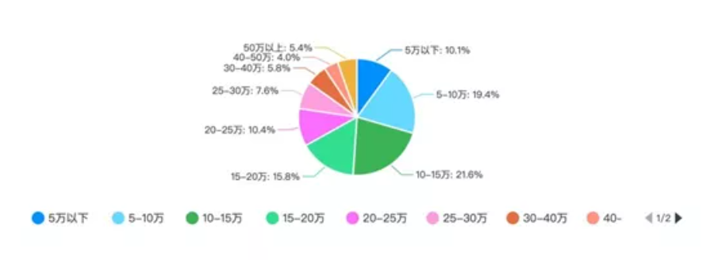
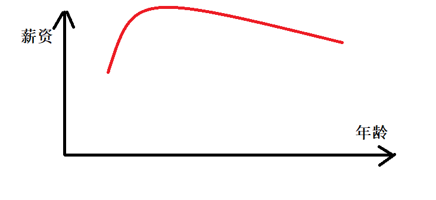
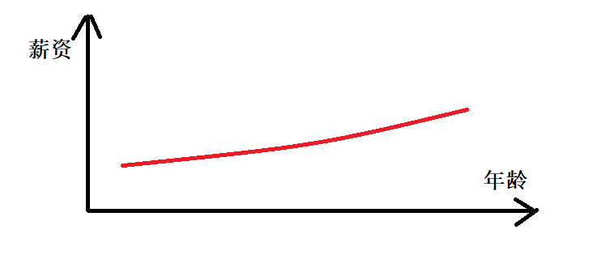
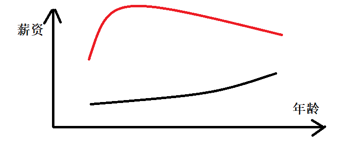

## 在中国，程序员前景一片灰暗？

> 路，是自己走出来的；机会，是自己创造出来的。

当我们看到网上有人在讲青春饭，有人在说自己年龄大被辞退了找不到工作的时候，我们一定要想想更深层次的原因。

**一个行业灰不灰暗，不是看一两个人的评价，也不是看一两个人的遭遇。**

你问一个到退休都是小科员水平的人，做公务员有没前途？

他和你说公务员没前途，你会信吗？

同样的

月薪5k的人说写程序没有前途，35岁失业

月薪5w的人说技术改变人生，努力就能站稳中产阶级

我们会相信谁的话？

**说到底，我们还是只相信我们想相信的罢了**，我们相信爱拼才会赢，就会觉得技术能改变人生，我们觉得自己不行，就会更害怕35岁失业。

在任何一个行业能做到年入百万以上的中上水平的从业者，肯定会说这个行业有前途，行业水平靠后的，很大概率会说没前途

**实际上，在2019年的行业调查中，IT行业薪酬水平稳居榜首，年平均工资为161352元；**

排在第二的是科学技术，为133459元；排在第三的是金融，为131405元。

再看看下面这张图，更直观了，有70%的程序员年薪在十万以上。

在这个行业里，一线、二线互联网公司的研发总监、架构师们，肯定都是富人阶级，有开保时捷911以上的实力

三、四、五线公司的研发总监、经理、技术专家们，解决一线城市房子车子问题，站稳在中产阶级，肯定是不在话下

**现在除了程序员，我真的找不到哪个行业能解决那么多就业人口的阶级上升问题**

我们总说程序员青春饭问题。

用曲线表示就是像下图，在年轻的时候薪资很高，但随着年龄的增长，我们技术能力、学习能力下降，也随着某些公司对大龄程序员的挑剔，大部分人会走下坡路

而我们都忽略了一个事实是，程序员的起点高，很多程序员在35岁以前创造的财富已经足以超过他们父母一辈子；

有些领域，看似随着年龄的增长，薪资一直在增长：

当你把两条曲线放在一起对比的时候，你可能会发现，人家涨到最高的点，还不如我们一些刚毕业大学生的工资高：

这样的职业有很多，这里为了避免不必要的冲突，就不再指明有哪些行业，大家可以到根据薪资报告来自行对比。

所以，程序员根本不是一个前景灰暗的职业，相反，我们的上限极高，我们可以完全不靠父母、不靠关系，自己达到年薪百万，也并不是什么难事。

**纵观其它行业，有多少能达到？**

**但任何行业都有三六九等，都是分梯度的。**

就像我跟朋友聊天，他家里没人带孩子，正在想办法。我问他怎么办，他说，总会有出路的，有钱的请保姆，没钱的自己带，最不济就是放老家，成了留守儿童呗。

我们不也一样？技术行的做架构、做管理，技术不行的转行产品、测试、运营也是一条路，实在不行，放下脸面降薪投投简历，也还是能找得到工作。

**只不过能力强的会越过越好、机会越来越多，能力弱的，只会越走越窄罢了。**

纵观各个行业，都是优胜劣汰的过程，除了在事业单位，还真没有能靠混日子过得很滋润的，如果有，请告诉我，我也想去。

## 本人所有文章皆为原创，著作权归 启舰 所有，未经授权，转载必究

