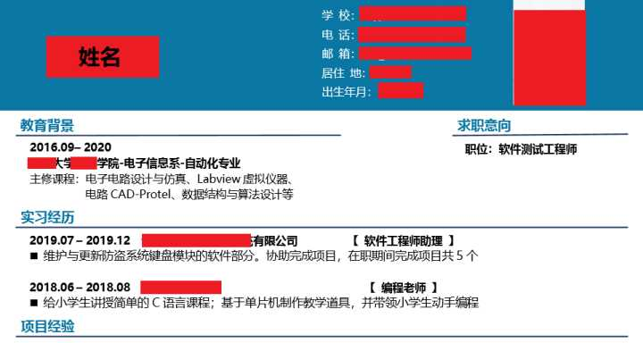
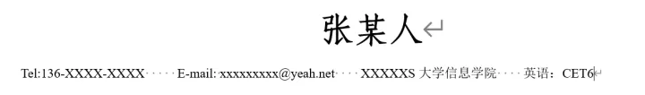
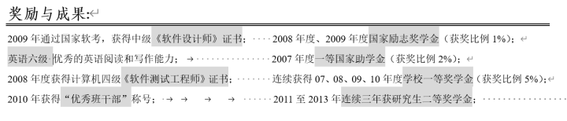
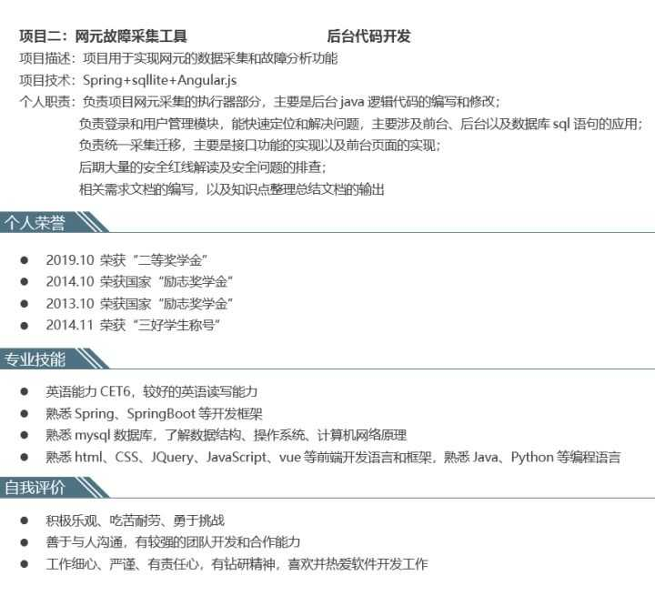
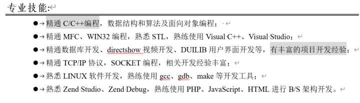
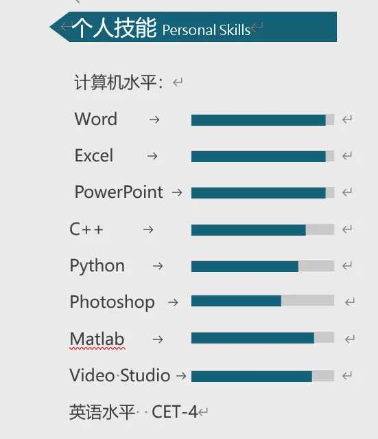
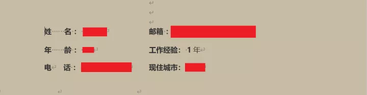
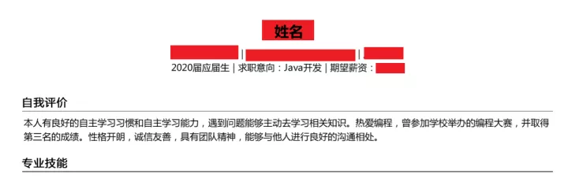

# 程序员垃圾简历长什么样？

>  至于未来会怎样，我也不知道。
>
>  要走下去才知道
>
>  反正路还很长，天总会亮

我已经连续五年参加大厂校招、社招的技术面试工作，简历看的不下于万份

**这篇文章会用实例告诉你，什么是差的程序员简历！**

今年春招时，义务帮小伙伴们看简历，公开征集简历。

一石激起千层浪，三天收到两百多封简历。

花光了两个星期的所有空闲时间，一一点评，一一回复，一一讨论与修正。

看光了所有简历以后，能称得上为范本的寥寥无几。

有些同学非常有实力，但看到他的简历时，根本不可能过简历筛选，算是自己把自己废了。

**我认为最好的简历，不是多好看，字数有多少，而是能恰到好处的展示你整个人的实力、能力与魅力。让别人能够完整地了解你，过于夸大和缩水，都是不行的。**

**下面，我们就来讨论下简历该怎么写，以及他们都犯了哪些错误吧，记得帮我点赞哦**

**文末有推荐的简历模板，可以下载，没任何套路，记得帮点赞就好。**

**长文预警，目录先行**

1. 排版太差
2. 暴殄天物
3. 进度条是个什么鬼？
4. 哪来的一年工作经验？
5. 劣势信息和废话写的那么靠前，是不想过了吗？
6. 简历模板及校招资源无套路下载 

## 一、排版太差

有些同学的简历，看起来就像是在写文章，洋洋洒洒地几个字占一行，卡卡给你整了几页，毫无美感。

**我们写简历，讲究简练、整齐。**

**简练就是短，字字珠玑。**

就是用最少的字，最少的版面，写出所有关键内容。

（这位同学的简历就非常的简练，每个字都有用，一点没有拖泥带水）

整齐就是排版大方得体，有些同学，排版错乱，不对齐，还有错别字。这种马大哈的简历，HR一看见就觉得不咋地。

看这位同学的简历，有些用图标，有些用文字，而且文字完全没对齐，毫无美感。个人简介这里不必写特长，下面已经有了专业技能栏，这里没必要再重复。

## 二、暴殄天物

暴殄天物就是钻石当沙子用!

**1、英语四六级**

大家觉得英语四六级重要吗？

有的同学觉得不重要，没有的同学觉得挺重要。

**而对于HR来讲，英语四级就相当于程序员标配，如果你没有，简历水平大打折扣。**

所以，四六级如果过了，要明显标出来，可以直接放在个人简介里

（简历模板，文章末尾会给出，免费下载）

如果自己证书较多，可以单独开一栏，明显地放在其中，因为证书一栏，HR是必看的，它能体现你在学习校的学习情况和学习能力：

（简历模板，文章末尾会给出，免费下载）

像有些同学明确写了一栏语言能力，也是可以的：

（某同学简历）

有些同学就玩躲猫猫特别好，把英语水平写在最后，而且跟其它信息夹杂在一起，标题也不语言、证书相关，HR就很容易遗漏，一旦遗漏就会认为你没有

**2、实习经历、项目经历**

**在程序员的简历中，最重要的莫过于实习经历和项目经历，这是直接让你区别于其它人的关键部分。**

而有些同学，就特别厉害，一带而过，你想深入了解下都毫无信息。

（简历模板，文章末尾会给出，免费下载）

如果有实习经历和项目经历一定要着重写，而且在写的时候，实习经历可以一带而过，写个职责简介即可：

（简历模板，文章末尾会给出，免费下载）

将实习经历中所涉及的项目，在项目经历中详细描述，描述时分为项目描述、项目职责、涉及技术：

（简历模板，文章末尾会给出，免费下载）

## 三、进度条是个什么鬼？

我们说，在写简历时，需要写专业技能，就是简单扼要地写出来自己会哪些，了解哪些。让面试管能够很快地对你的技术栈有所了解。

（简历模板，文章末尾会给出，免费下载）

**有些同学就牛逼了，使用进度条，生怕人家知道他具体会啥。**

上面Python标的进度条是熟悉，那请问，您对Python哪里熟悉呢，Python Web开发会不会？Python文件操作会不会？有没有会用的IDE？这些信息完全没有。

**所以，你会啥，你要写出来，你不说，人家怎么知道呢？**

不是说，不能用进度条。而是程序员这个行业求职简历，不适合用进度条。

像运营、产品这类弱技术知识的职业，是可以使用进度条的，但程序员不行！

## 四、哪来的一年工作经验

实习就说实习，还没毕业哪来的一年工作经验？

还没毕业就说自己一年工作经验，好像培训班的套路。

**这是非常另人反感的，不诚信，而且是非常傻的不诚信。**

有些同学问我，启舰，简历我能夸大吗？

**当然可以夸大，现在有几个应届生不吹的，明明自己学习上都数不着，写上绩点Top 5%。了解写熟悉，熟悉写精通，不都这么干！**

但有些东西是不能作假的！

那些能明显被查出来的，而且肯定会查的东西不能做假。

比如工作履历，学校，学位。

**有些同学，专科写本科，甚至还伪造证书，这都是极其蠢的行为，因为HR入职时，都会在学信网上去查，学历和学校是造不得假的。**

**但凡能公开查到的信息，不能造假！**

## 五、劣势信息和废话写的那么靠前，是不想过了吗？

**1、废话少说**

你要知道，每个简历基本上五秒以内就会被离手。那怎样在这么短的时间内怎么突出自己的实力是非常重要的。

人看东西都是自上而下，所以自己的核心竞争力要靠前写，不是竞争力的靠后写。

有些同学就特别猛，老怕人家不要他，上来就来个自我简介，把自己一顿乱夸。

**真正有体现竞争力是你的技术描述、项目描述、实习过程，而不是自吹自擂！自嗨是没有用的。**

如果文字太多的时候，我们都可以把自我介绍给去掉。这部分内容是最不重要的。对于面试官而言，重要的客观事实，而不是主观臆断！

**2、劣势信息靠后**

一般而言的劣势信息有，学历，项目经历薄弱等等，反正你觉得你哪里好的就靠前写，哪里不好的就靠后写。

所以，**我认为最好的简历，不是多好看，字数有多少，而是能恰到好处的展示你整个人的实力、能力与魅力。让别人能够完整地了解你，这就达到简历的目的了。**

大家并不一定完全使用这个模板，大家可以自己去找模板，只要把能模板上的信息完整地填充到你的模板上，都是很好的简历。

给大家看看几个写的堪称范本的同学的简历。

（某同学范本简历展示）

这位同学的模板就很好，非常简练，一点没有拖泥带水，关键信息一个不少。这就是好简历模板。

这位同学，虽然在专业技能处用了进度条表示，但整个模板是很好的。清晰简洁，条理分明。只需要把专业技能和项目描述都再修改下描述，就已经是非常好的范本了。

**所以简历好不好，不是看它长的什么样，你用的模板什么样，关键是看这个模板，能不能简单明细地体现出你的实力，这是最重要的。**

## **六、简历模板及校招推荐资源下载**

**千呼万唤始出来，**  我用了近一个月的空余时间，搜集了各个大厂的笔试题、面试题、面试推荐的书籍、及我推荐的简历模板等等，共18G

除了这些现成的资料以外，还有我曾经受邀辅导毕业生校招，给他们总结的题型（带答案）及简历模板，全网独此一份，都是血心结晶，希望能切实的帮到大家。

**扫描下方二维码，回复『 214 』，即可获取**。 没有任何套路，大家放心下载

**好了，我是 启舰，真心的希望，你的简历能够最大程度地展示你的水平。**

**我们下篇文章见。**

## 本人所有文章皆为原创，著作权归 启舰 所有，未经授权，转载必究
