## 今年大三，兼职年入六万，方法路径分享

> 本文来自POPO同学的投稿，在我B站中有关兼职挣钱的视频火了以后，POPO同学主动把自己的兼职经验分享给大家。整篇文章涵盖了大量的教程截图，简直真是太贴心。POPO一年兼职收入五六万呢，在校的同学们，可以参考文中的方法进行尝试。

普通学校准大三学生，平均年收入5-6万，实现了基本独立。不说废话了就直接告诉你我是怎么做到的吧。如果有小伙伴不信呢就只能放放微信账单啦，毕竟这是传统（手动狗头

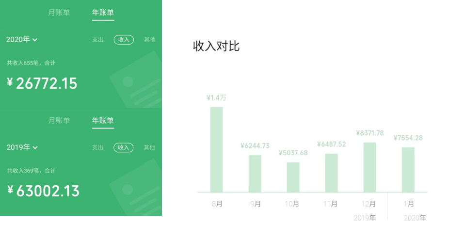

当然2020前几个月收入不高主要是因为疫情，培训机构不能开我自然也就领不到什么工资，1月和8月工资相对来说比较高是因为寒暑假，机构就是假期赚钱比较多嘛。

 我的收入主要来自三个部分：培训机构兼职、平台写作变现和fiverr上做翻译（这个我会详细出教程）。

### **一、 培训机构兼职**

这是我收入最大的一个部分，也是和其他途径比起来更稳定的。一周上课2天（周末），每天的工资大概是500，平时一个月工资能有4500，寒暑假集中课程的话冲一冲可以月薪过万。目前和老板是签了两年的合同，应该会续约。

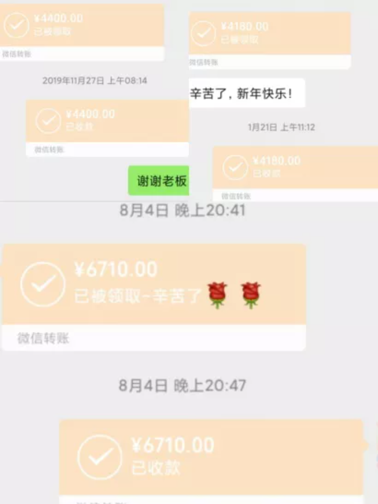

为了磨练自己（其实是因为贫穷），我加了学校兼职群在里面等待很久一直蹲消息。先前的两个月主要在做一些体力活，又累工资又累，一天五个小时大概只有50块钱，在外面推销乐高课程的免费体验课。虽然工资很低，不过我确实脸皮被磨厚了，也算得上值。 

两个月之后我看到学姐发了一个消息，就是说培训机构在招英语老师，要求能做长期的，周末有空的，工资在3000-5000.我一看到当然是很开心了，外地学生周末不需要回家，大一的我肯定可以做上一两年就去私聊了学姐，然后面试。

这中间的一个插曲是，老板说他选中了我只因为我看起来比较老实有责任心，虽然经验不是最多的，年纪也是最小的。后来我才知道，老板挑中了我主要是因为**：1. 我看起来老（家长不会怀疑）2. 年纪最小（可以做长期的）3. 没有经验（便宜）**

我是比较幸运的那一类，不过针对想去培训机构做英语老师的小伙伴，我也有些经验可以分享出来：

**1. 多关注学校兼职群**

虽然学校兼职群发出来的很多都是来廉价劳动力的消息，比如保安、端盘子的服务员、发传单等，但是有些比较急的好工作会直接在学校兼职群里发。

**2. 大一寒暑假可以去新某方实习，很有帮助** 

市面上不太成熟的小机构会倾向于用大学生来当老师，因为便宜。这个时候假如自己手里能拿个其他大机构的实习证明，个人价值肯定是往上涨，也会瞬间和其他人拉开差距。

**3. 和学长学姐搞好关系**

确实有很多学长学姐在划水，不过总的来说，学长学姐手里拥有的资源比我们的多一些。想一想他们在毕业之后如果需要找新人替他们的话会找谁呢？对啦！就是学弟学妹，因为同届的也已经毕业了。这个时候关系能搞好一点的话，基本上他们是可以帮忙推荐的，比自己等消息或者乱找有效率多了。

### **二、 网络平台写作**

疫情期间因为培训机构不复工收入断过几个月，我就开始了知乎的写作，希望能接一些广告，因为运气比较好遇到了很好的广告商，我接到了两条广告，单价1800（第一个月300，永久合作再加1500），总共收入是3600。虽然和工资比起来不算多，不过也基本上能满足生活了，反正因为疫情也去不了哪儿。

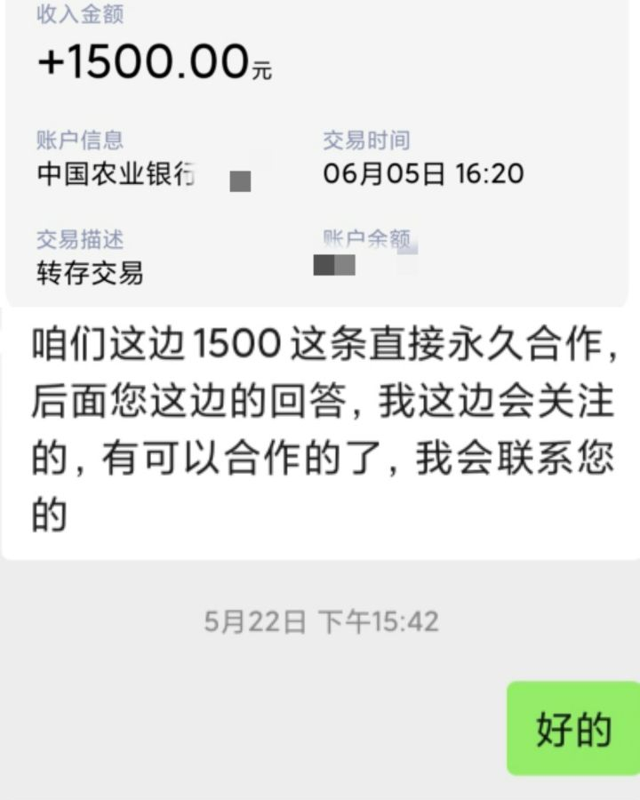

关于知乎写作，以及大家可以看到的什么今日头条、小红书、公众号写作变现我本人不是很推荐每个人都去做，因为等待的时间确实比较长，而且文笔一般的也很难看到成效。

当然现在我本人知乎账号是停止接广告了的，我想把知乎变成一个自己想说什么就说什么的平台。

### **三、 Fiverr上做翻译**

这是这篇回答的重点，也是我自己在尝到甜头后决定推介给大家的，先看我7月在接到三个账单情况下的收益情况，目前账户里有大概1000人民币，三个订单总用时4天。

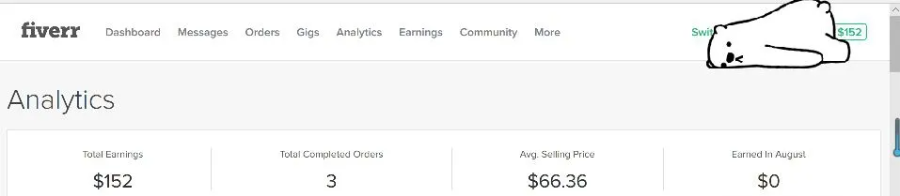

首先介绍一下fiverr，它是海外的兼职平台，出售各种服务包括图片视频制作、绘画、翻译等等，也有大神在上面给老外算命（哈哈哈哈哈哈），买家和卖家是直接联系的，不过平台会收取20%的佣金，因为每个单子的最低价格为5（five）美元，所以是fiverr。

**因为我做的是翻译，所以也只给大家出翻译的教程**，其他的我没有经历也没有什么资格评价。 

教程正式开始之前，我有几句话想说：

**1. 翻译是有门槛的，至少也得英语过四级吧**

**2. 登陆fiverr的时候不要翻墙，不然可能会被系统检测到然后直接封号**

**3. Fiverr接第一单是最难的，需要有耐心**

**4. 在fiverr上做翻译需要有比较灵活的时间来应对突如其来的订单**

**5. 不会的单词可以查，不要随意乱选**

**6. 百度是个好东西**

 在fiverr上做翻译的第一步，打开fiverr的官网，注册账号

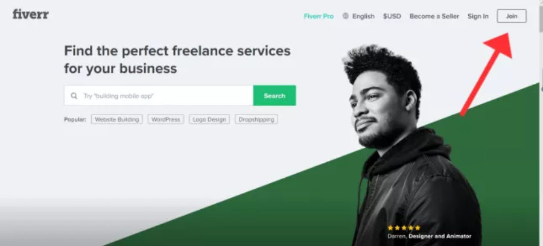

然后选择一个方式进行注册，Facebook、Google、苹果账号、邮箱都可以。我是用的QQ邮箱，之后会发送一个验证码到邮箱，填写就行了。

输完之后需要填写自己的用户名和密码

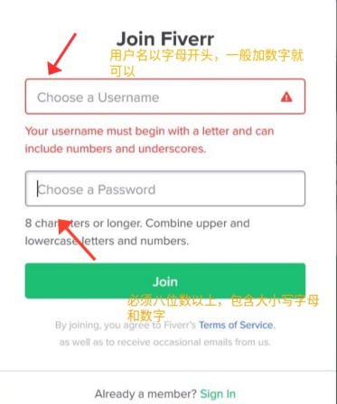

填完之后点Join，如果出现卡顿的话就需要借用网上的教程，等我去搬运一个链接 

链接在这里： 

https://www.wok99.com/450.html

注册成功之后我们会来到这个页面，点Become a Seller

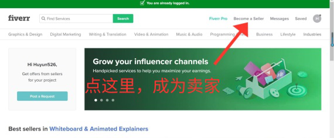

接着就是死亡四连，直接点跳过就行

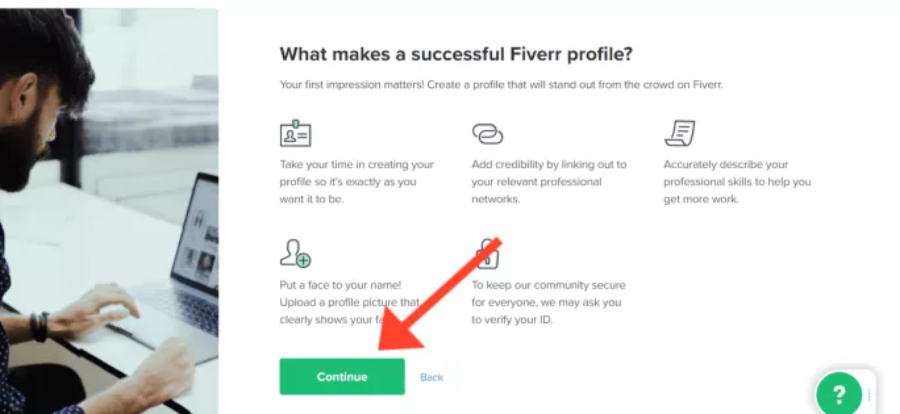

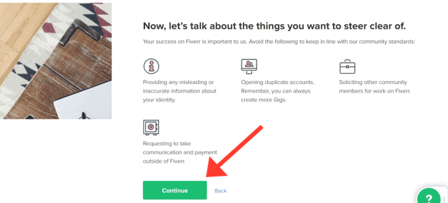

跳过之后我们会来到一个界面，填写自己的个人信息

首先是个人的名字是头像。名字用中文的就可以，我自己是选择每个字母都大写，因为姓名短且想引起注意，头像最好用真人的，我自己是不要脸的找了一张PS十级的美颜。

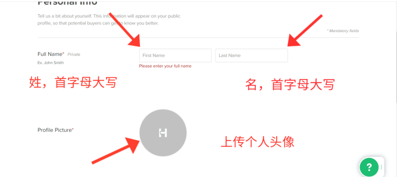

如果只是做翻译，就说自己学英语几年啦，水平如何。语言一栏就把自己会的都加上，我加了中文和英语。

中文我选择了native母语，英语选择了fluent流利。

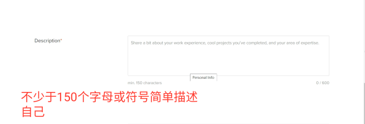

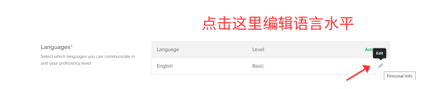

方向一栏可填2-5个，写在自己能力内的最好，不然到时候翻译起来会很难受。

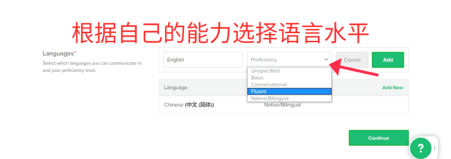

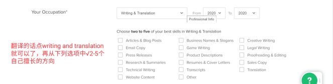

技能的话一般就是写英语或者翻译就好了，熟练程度我写的是intermediate

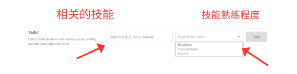

教育情况如实写，因为有的买家可能会做检测

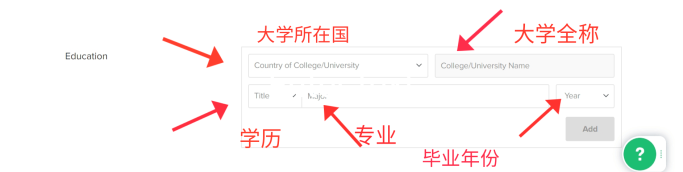

大学四六级或者英语相关证书都可以填上，个人网页可以不填，如果有可以证明自己翻译能力的个人网页也可以贴上

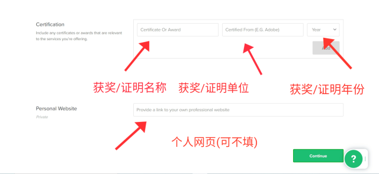

Fiverr会发到邮箱，在邮箱里点网站激活就可以。绑定手机有两种，电话和短信，用电话会很快，fiverr从美国打一个电话过来，带四位数的验证码，如实填写就行了。

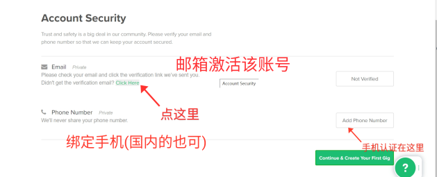

假如出现这个画面就是信息填的不够，回去填写就好，尤其是邮箱激活和绑定手机，占很大的比例

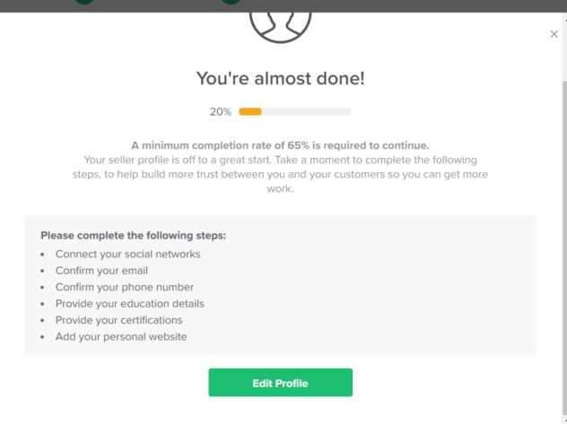

出现这个页面就说明个人信息已经建立完成，继续往下走

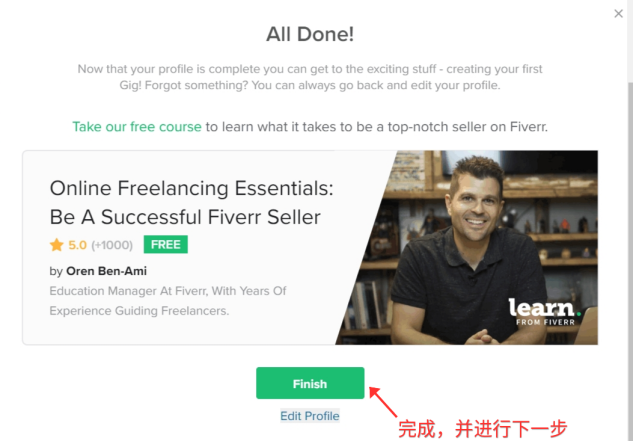

然后开始创造自己的Gig，相当于商品介绍

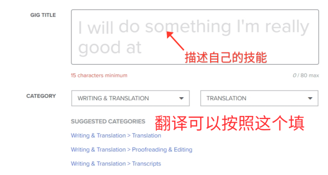

把自己会的语言贴上就好，industry expertise（行业专业知识）和document type（文档类型）根据自己的实际情况来就好了

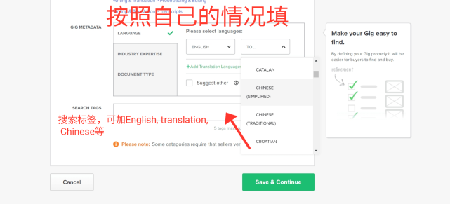

中文我选的是CHINESE SIMPLIFIED（简体字），而不是TRADITIONAL CHINESE（繁体字），文档类型就选了个GENERAL（一般）

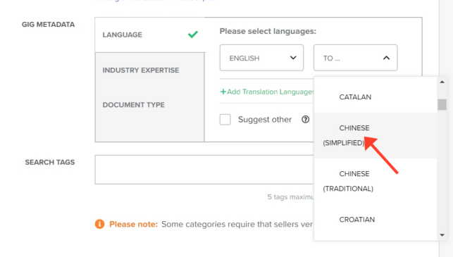

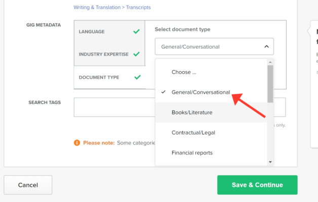

根据翻译文本的难度可分为BASIC（基础）, STANDARD（一般）, PREMIUM（难），name your package那里填的是翻译内容，比如海报、视频字幕、论文、故事等，describe the details of your offering就说自己将怎样完成翻译，delivery time就是从订单开始翻译的倒计时，我的时长从短到长是2天、5天、15天

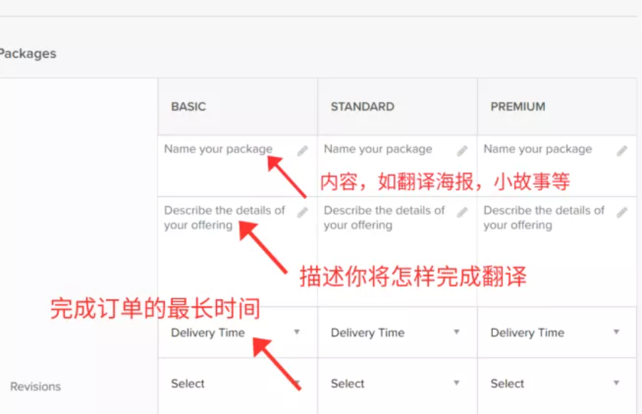

Revisions就是客户可要求更改或者加入的次数，我全部都填写的两次，不然多了的话遇到刁钻的客人会很麻烦，价格的话在一开始还是定得比较低比较好，接的单多了再慢慢增加价格

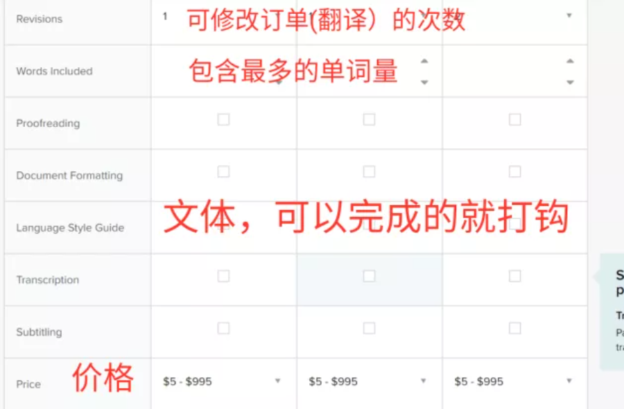

订单的其他款项

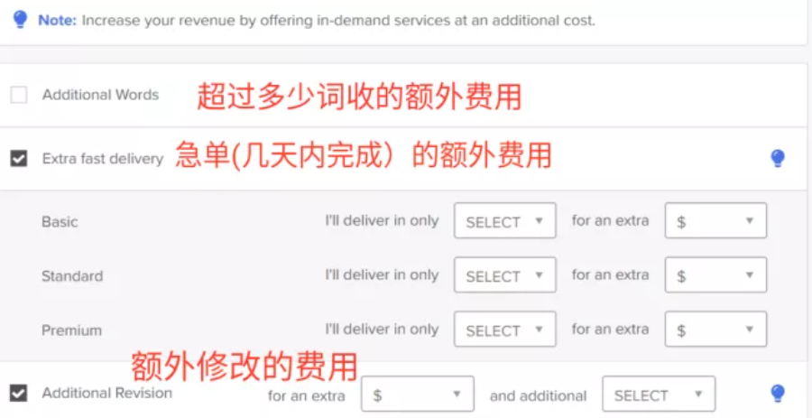

描述自己的Gig,可看看优质卖家是怎么写的

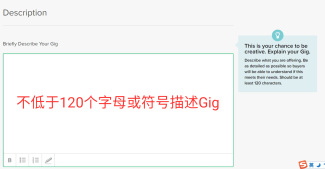

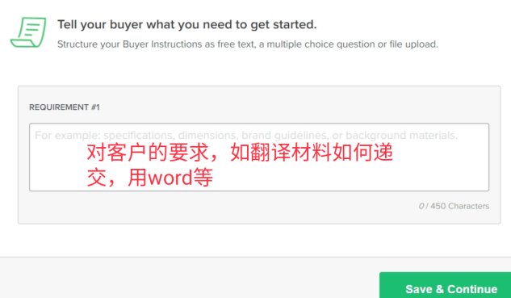

相当于产品封面，一定要做好看，同时注意图片格式

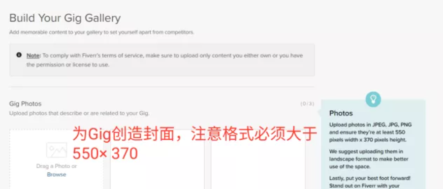

视频和PDF的添加可有可无，有的话是锦上添花而已

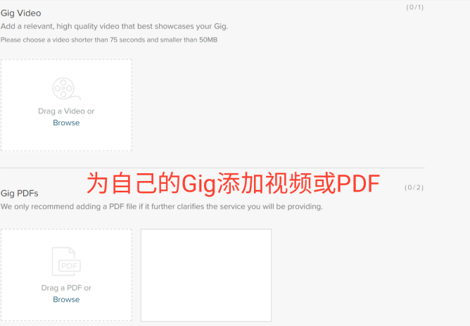

到这里基本上完成了，点这里公开Gig，否则是无效的

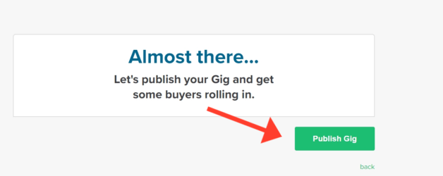

出现这个画面就说明账号的Gig已经激活

回到主页点开Gig, active这一栏出现就说明已经成功激活，edit可以修改gig

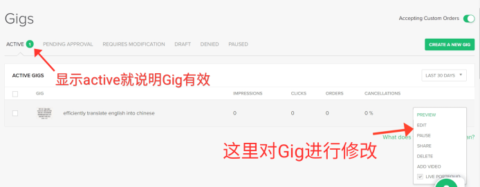

到这里就结束了，接下来做的事情就是静静地等待第一单，我五月注册七月才接到第一单，接着浏览量和订单都在慢慢增多。我也是个新手，也期待自己的账号能有比较大的进步，我和大家一起都耐心的等待。

##  本篇文章为付费约稿，著作权归 启舰 所有，未经授权，转载必究

