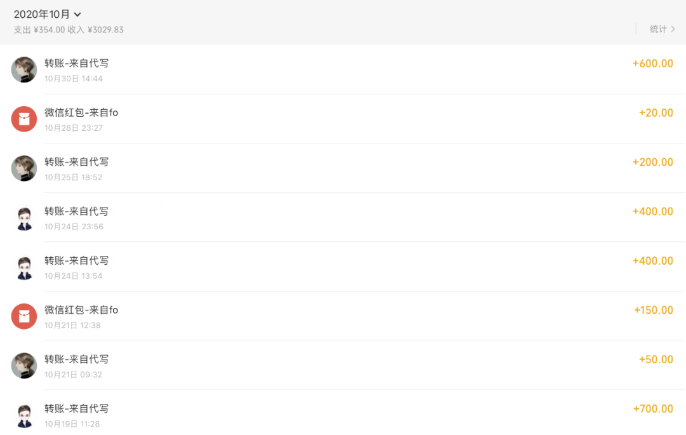

## 读者牛逼！接澳洲的单子，一天600，方法路径分享！

大家好，我是启舰。

前几天写了一篇文章[《在校大学生如何用编程赚钱？| 我的大学赚钱之路》](http://mp.weixin.qq.com/s?__biz=MzIxODM1NTQ4NQ==&mid=2247502408&idx=1&sn=564c8d4ab8dacccf4971bd4850004614&chksm=97e9483aa09ec12ce1875898da82a93a0197a19ba1c6a315b9fbcee95b6752dc707c8d2dff0b&scene=21#wechat_redirect)，来解答大家除了接外包以外的，靠编程的挣钱之道。

其中有个同学的留言，引起很多读者的兴趣。

很多同学想详细了解下，他具体是怎么做的。

说实话，我也非常感兴趣。一天挣600块，对于大学生来说，已经非常多了。

庆幸的是，这位同学非常慷慨，愿意投稿，来跟大家分享自己的挣钱之道。

这篇文章，就来自这位同学的投稿。

来吧，展示！

------

大家好，我是启舰的一名粉丝。上次在[《我的大学是怎样靠编程挣钱的？被坑两千块以后挣了十万》](http://mp.weixin.qq.com/s?__biz=MzIxODM1NTQ4NQ==&mid=2247502408&idx=1&sn=564c8d4ab8dacccf4971bd4850004614&chksm=97e9483aa09ec12ce1875898da82a93a0197a19ba1c6a315b9fbcee95b6752dc707c8d2dff0b&scene=21#wechat_redirect)的文章里回复说可以做澳洲代写挣钱，大家表示想让我详细说说，于是我写下这篇文章。

我在香港读大一，断断续续做过几个月代写，也实习过，在这篇文章里讲一讲留学生代写行业和我对代写的看法。以下内容不一定准确，只是凭印象总结。没有人能完整知道代写行业的方方面面。

### 关于收入

下面是我在去年10月和11月的代写收入，这是在兼顾额外的活动和课业的情况下的收入，没有接太多，几天一单的样子。一天一单的话月入能上万

### 代写包括哪些内容

代写行业很大，主要是给不想写作业或没时间做作业的人准备的。有什么样的作业就有什么样的代写内容。最近疫情，代写也加上了代考试的业务，不过以后就不多见了。

代写的科目区分很大，比如文科商科经常是作报告、写文章，工科是推公式，不过我不是相关专业的，也没有实际做过。代写的人群主要有两类：本地学生代写和留学生代写。代写也分等级，最高端的代写价格昂贵，一单几千刀，一般是给不差钱的主，要求的服务质量非常高，比如做到90分以上，做不到还要写手/中介倒贴钱；中端的代写要求没太高，及格就行。

我主要做的是针对留学生的中端CS代写。这个方向是比较有优势的

- 有一定的门槛，材料为全英文，写手少，订单多。全英文材料本身就能提价。同样的代写内容，中文材料比英文材料的便宜一半。但门槛不算太高，毕竟高端的代写咱没资源也没那个实力
- 代写过程中能够学习澳洲学校的课件。我这边代写的客户主要是澳洲的学生。他们的课件的质量是真的好，在代写的过程中能对知识进行巩固
- 结单快，快的话一单几个小时就能基本完成，然后和客户扯皮几天，再改改，净收入600元左右。偶尔也能见到工作量太大的单子，一般是不接的。
- 这个方向的写手少，很多中介做文科商科起家，但也遇到大量CS单子，急缺CS写手。我经常遇到一些单子，我自己没把握，但别人更做不了的情况。

### 代写的流程

代写流程主要是接单-派发-完成-修改-结单，中介接单后会派发给写手，写手给一个价格，然后加价报给客户。结单一般是提交完整的代码，这时写手就可以拿到钱了（具体按中介平台的流程走）。如果客户最后作业没及格，这笔钱还是要退掉的。

在派发环节，不同的中介不一样。有的中介自研了一套平台，有的中介发朋友圈，有的中介亲自联系写手，我倾向于亲自联系写手，因为这样比较省心，不会错过单子，也不需要和别的写手抢

### 代写的行规

- 写手和客户绝对不能直接沟通，因为一旦产生了纠纷容易纠缠不清，不遇到纠纷会断了中介的财路。
- 中介的抽成一般在5成左右
- 一定要原创，国外查重很严，对于作弊的处罚很严重
- 中介一般互相认识，会消化对方处理不过来的单子
- 如果违反了行规，容易上黑名单，接不到单子

### 如何加入代写

首先要能看到代写的广告，然后联系对方。之后告诉对方自己是写手，做哪一方面的内容就可以了。

不需要自己是留学生，但需要能看懂英文。

流程比较简单，没有身份验证，也不需要身份验证。

之后中介会给试着给你单子，做得好会一直做，做得不好就没有单子了。

>  启舰：

>  这里作者提供了两个接单的中介个人微信号。由于没办法核实，暂时从文章中去除。有需要的同学，可以加我微信，私发你，暗号：代写。（注意：任何兼职都存在风险，但凡提前交钱的都是骗子，接单需谨慎！）
>
> 
>
> （暗号：代写）

###  技术相关

代写的语言千奇百怪，除了常见的Python，Java，C/C++，我还写过汇编，Scala，Ruby，某教授自创的语言，某声明式逻辑语言、Matlab等。代写的范围也是非常大，但主要是必修课，从最基本的程序设计（游戏），到程序测试、安全分析，从网络到多线程，从机器学习到深度学习，甚至还有图形学和高并发编程。有的作业需要写报告，这种慎重，因为你不知道教授的脾气怎么样。我写程序还行，有的课目需要理论分析，我自学的理论虽然有道理，但教授不认啊。

真的是有一分实力挣一分钱，自己会多个语言，就能接多个单子；自己学过哪些领域，就能做哪些课。接的单子难度一般不大，多是本科入门课的周作业或大作业，随便学学就能完成，熟练的话能够得心应手。

### 单干/我自己带团队？

恭喜你，你成为了资本家。有能力的写手有的会选择自己带团队，自己成为了代写中介。只要有一手客源和写手资源就可以这样做，服务范围在几所学校，打广告靠口口相传和留学群群发。只要价格公道，质量过硬，收入比代写要高很多。当然风险和时间投入也更多，看是否值得的了。

###  对代写行业的看法

这是灰色产业，但不至于到违法犯罪。代写的客户是学术不诚信，写手和中介是顺应代写客户的需求。

我不希望大家找人代写，要认真对待自己的学业。代写比较灵活，一年中有半年的旺季，想挣点零花钱了可以随手接几单，忙的时候和中介说一声，中介也暂时不会打扰你。

少量接单对自己的学业也有帮助。但接单多了容易陷入陷阱，影响自己在学术上的深入研究。

另外不推荐专职做代写，尤其是写手。进大厂的工资比代写的收入多太多了。自己带团队稍微好点，但也许要一步步发展起来，才有值得全职做的收入。

## 本篇文章为付费约稿，著作权归 启舰 所有，未经授权，转载必究

