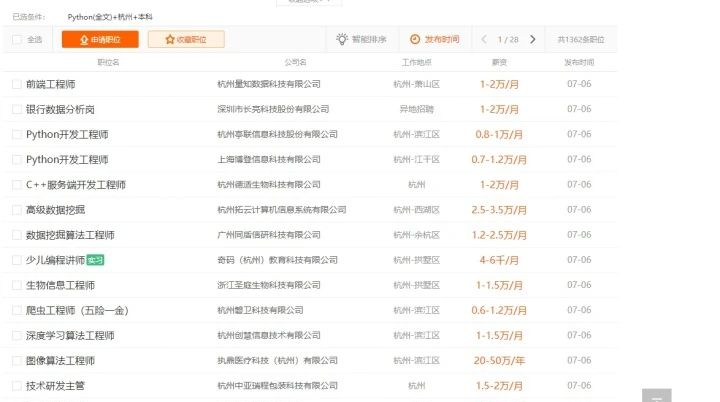
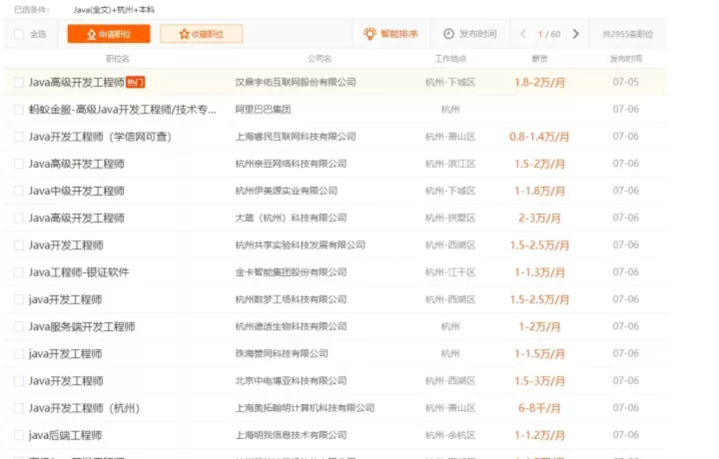

## 我为什么推荐学Python，但不希望大家用Python找工作？

>  人，只要不失去方向，就不会失去自己。

现在铺天盖地的Python培训广告，而且Python非常简单易学，高考都已经在考Python了，有些小伙伴直呼，跨界做程序员的春天终于到了。

然而现实情况却是，等你学完Python，你却发现，完全找不到工作是怎么回事？

虽然我也有文章建议大家从Python开始学习编程，但并不意味着就要利用Python找工作，使用Python找工作的门槛是很高的，大部分的同学都将成为炮灰

至于原因，这篇文章告诉你，记得帮我点赞哦。

## **一、Python能干什么** 

我多次地讲过，我们要学会面向找工作学编程，很多小伙伴就是不听。很多东西，上招聘网站上看一看岗位要求、岗位数量一对比，就知道好不好就业了。

假如我们单纯地对下比Python和Java的岗位看下区别：先来看下Python的：

里面多的是数据分析，数据挖掘，图像算法之类。这些都是需要一定的计算机基础，对数学的要求也比较高。说实话，普通人入门玩玩还是可以的，要想找工作还是不推荐。相反，Java的情况是：

开发、开发、开发.....

很明显，Java更适合普通人。

## **二、成也萧何，败也萧何** 

大家都知道Python简单易学，完全没有学过编程的，努力几个月就已经能够写出像样的Python程序了。

同样地，已经有基础的程序员，花几个星期，就能达到初学者学几个月的水平，而且人家完全比你更容易胜任Python的工作。

招人时，小公司觉得单独招个python程序员不合算，让写Java/C/C++……这样的程序员学上个几个星期就能入手了。

大公司觉得，也许你对python了解是够了，但是业务上的那些坑你还没踩多少，不如招个熟手。

**从这个角度也可以看出，对于非强Python依赖的公司，并不太会招Python程序员，这也就导致了Python岗位减少。**

**对于强Python依赖的公司，则是些要求高学历的，光学历门槛就能被堵死。**

**所以，如果你不是高学历者的专业对口的同学，则不建议使用Python找工作，可仅用于Python用于入门。**

##  **三、为什么建议从Python入门** 

很多跨专业的、刚学计算机的小伙伴，显然C++对他们来讲，太难了。

在没有人指导的情况下自学，简直想原地爆炸，这种心态我是经历过的。

**而Python就不一样，有很多现在的库，配置、编译、运行都非常方便，很容易出效果，能够极大地增强初学者的信心。**

但凡有经验的老鸟都知道，编程其实是思维的创造，任何语言都只是工具。所以，当你学会Python以后，也就养成了编程思维，那时候，再去学其它语言，就非常容易了。

所以，我建议没有基础的小伙伴，可以从Python开始，才能真正体会到编程的乐趣，而不是单纯靠自己的毅力坚持。

**所以，总结来讲，如果你不是计算机专业硕士毕业，不建议只使用Python找工作，可仅用于Python入门这个行业。**

**好了，我是 启舰，希望大家都能找到满意的工作。**

**我们下篇文章见。**

## 本人所有文章皆为原创，著作权归 启舰 所有，未经授权，转载必究

