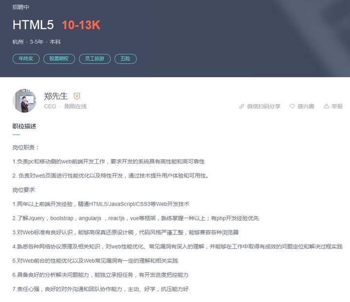
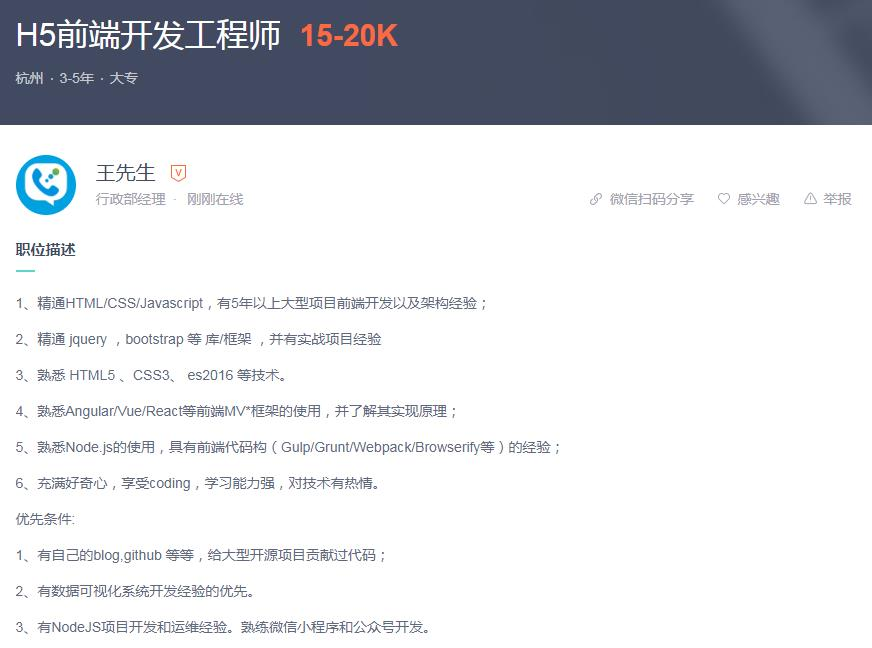
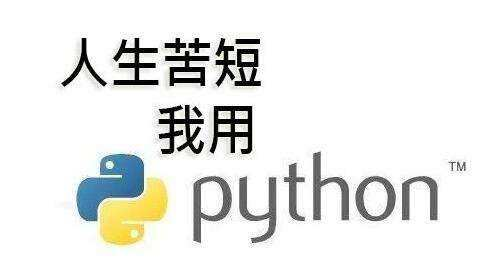
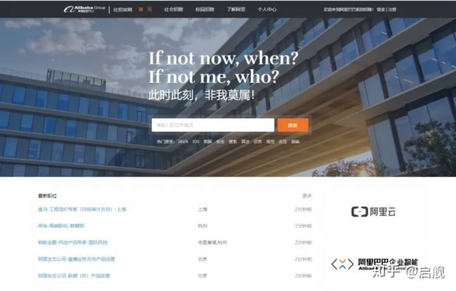
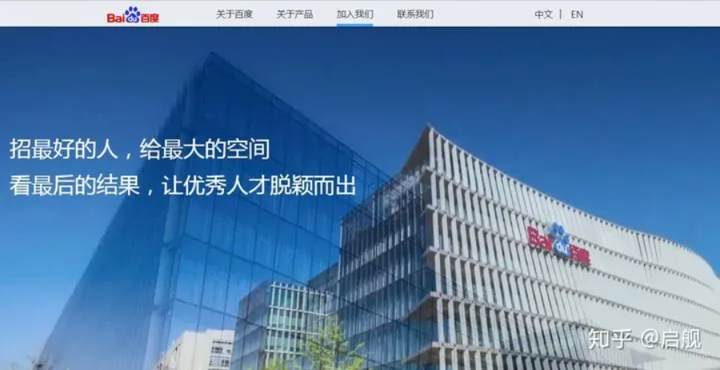

# 计算机专业如何高质量的走完大学四年?毕业成为Offer收割机

> 此刻很痛苦，等过阵子回头看看，会发现其实那都不算事

"就要毕业了。

回头看自己所谓的大学生活，

我想哭，不是因为离别，而是因为什么都没学到。

我不知，简历该怎么写，若是以往我会让它空白。

最大的收获也许是……对什么都没有的忍耐和适应……"

这是一个大四同学给李开复的信，这封来信道出了不少大三、大四学生的心声。大学期间，有许多学生放任自己、虚度光阴，还有许多学生始终也找不到正确的学习方向。当他们被第一次补考通知唤醒时，当他们收到第一封来自应聘企业的婉拒信时，这些学生才惊讶地发现，自己的前途是那么渺茫，一切努力似乎都为时已晚……

在大学期间，我自己也是非常努力，得过国家励志奖学金、连续四年获得学校一等奖学金、国家助学金、英语六级、中级软考证书、四级测试工程师证书、学校组织的各种竞赛/活动证书一大堆。当时的我，觉得自己很牛Ｂ……直到毕业，才发现，根本找不到工作，能进得去的都是些几个人的小公司，后来，读了研究生……

现在毕业近十年，辗转几个大厂，做过几年校招＼社招面试官，再回首大学生涯，才知道很多努力都是白费，很多奖项其实无用。

**青春总是如此开场，憧憬又迷茫，有时却贻笑大方。人啊，总是错过一次，才知道珍惜，可人生却只有一次。**

有些同学毕业时，很快能找到工作，人称OFFER收割机，而有些同学经历完秋招＼春招，一个OFFER收不到。有些同学成绩不好，却处处有人要，有些同学绩点很高，却找不到工作。

**经过几次校招，看过太多的期盼与落寞，太多的失望与痛苦，希望此类的事情不再发生在你身上。**

四年的努力决定了你毕业时的高度，决定了你能进入什么样的公司，拿着什么样的薪资，过着什么样的生活。

毕业进大公司，之后BAT随便跳，毕业进创业公司，想进大公司至少五年后。大学四年，决定着你一生的命运。多努力点，生活总不会亏待于你。

**结合自己的经历和这几年的校招社招经验， 和大家分享下，大学四年里要怎么度过，什么才是真正要追逐的东西，如何规划你的大学四年，才能成为OFFER收割机，记得帮我点赞哦。**

**目录：**

- 四年真的很长?
- 大学的本质是什么
- 目标导向，以终为始，规划人生
- 啥都不会怎么办
- 计算机专业哪些课程必须学
- 哪些比赛才真的有用
- 计算机专业如何找实习
- 一些建议

## **一、四年真的很长？**

刚进校的时候，可能每个人都有这样那样的可能，将来可能读研，可能出国，可能...当老师问你，你毕业了想干嘛？那时的你，可以开足了马力展开想象。

但当你真的毕业时，当时的想象，可能还只是想象……

千万不要觉得大学四年很长，其实大三就要开始找实习了，你最多只有三年的学习时间，三年时间内你还有很多事要做。

如果以就业为导向，大四上学期的9月份开始校招。至此，大学基本划上句号，之前所有的努力，此刻就是试金石，所有的努力都会在此刻体现。从大一入学到大四校招，总共三年准备时间。

如果以考研为目标，大三上学期过完的12月份很多人就已经在开始准备初试，为了防止考研落榜，必然需要在大三上学期前把所找工作所需要的技能准备好，不然当考研考不上的时候，连个工作都找不到。你的时间会更短，只有两年半的准备时间。

我曾经写过一篇文章，详细讲述了，在校招时，非常有用的几个光环：名校光环、竞赛光环、项目光环、实习光环。

如果你想毕业时在众人中独占鳌头，实习经验不能少。所以，到了大三，你还要想办法去参加实习，这又将你的准备时间向前提了半年。

**所以，整个大学生涯如果真的想不枉此行，最多只有两年半的时间给你学习。**

当然，可能有些同学说，我什么也不会，校招时也能进大厂。我前面也说了，校招时有几个光环，如果你学校足够好，绩点也还行。校招时也会有人要。

但如果你把自己的一生都赌在学校光环上，如果校招不利，恐怕也只有培训才能救你。 

**凡有所失，必有所得，凡有所得，必有所失。每个时代都会悄悄犒赏努力的人。**

没有人生来就是主角，所有主角都是从龙套开始，一步一步脚印，才能把自己的路走出万丈光芒。

不少人在高中时候，尤其是高三的时候，会听老师说：高中是最辛苦的，辛苦了这阵，等考上了大学，想怎么玩就怎么玩！

这只是善意的谎言，不要当真。

**但凡表面光鲜的人，背后都有不为人知的辛酸。加油吧，趁现在还不晚。**

## **二、大学的本质是什么？**

你真的以为：

老师眼里的好学生，上课时的乖乖仔，门门考第一，毕业时就真的能找到好工作？

天天翘课的坏学生，毕业就一定不如你？

以找工作而言，讲究的实战能力，项目经验，能不能直接上手干活的能力。这些东西，学校里都是不会教的。

或许，你跟我有一样的疑惑：“上完大学，连写个软件都不教，那上大学有什么用？”

直到，我看到李开复对于大学本质的讨论，才豁然开朗：

> 记得我在哥伦比亚大学任助教时，曾有位中国学生的家长向我抱怨说：“你们大学里到底在教些什么？我孩子读完了大二计算机系，居然连VisiCalc都不会用。”
>
> 我当时回答道：“电脑的发展日新月异。我们不能保证大学里所教的任何一项技术在五年以后仍然管用，我们也不能保证学生可以学会每一种技术和工具。我们能保证的是，你的孩子将学会思考，并掌握学习的方法，这样，无论五年以后出现什么样的新技术或新工具，你的孩子都能游刃有余。”
>
> 她接着问：“学最新的软件不是教育，那教育的本质究竟是什么呢？”
>
> 我回答说：“如果我们将学过的东西忘得一干二净时，最后剩下来的东西就是教育的本质了。
>
> 我当时说的这句话来自教育家B. F. Skinner的名言。所谓“剩下来的东西”，其实就是自学的能力，也就是举一反三或无师自通的能力。大学不是“职业培训班”，而是一个让学生适应社会，适应不同工作岗位的平台。
>
> 在大学期间，学习专业知识固然重要，但更重要的还是要学习独立思考的方法，培养举一反三的能力，只有这样，大学毕业生才能适应瞬息万变的未来世界。我认识的不少在中国读完大学来美国念研究生的朋友。他们认为来美国后，不论是学习，工作还是生活他们最缺乏的是独立思考的能力因为在国内时他们很少独立思考和独立决策。

**我们都喜欢看武侠小说，但凡练武，都讲究内练心法、外练招式。内功足够强大，没有招式还是施展不出来。只有招式，没有内功支撑，则只是花架子，没有攻击力。但凡高手，都是内外兼修。**

大家总是在讲科班与非科班的区别，区别大概就在于此。

所有语法、框架，说到底都只是工具。只要熟悉了工具的使用，就能够编出来软件。这就是武功里的招式。

而学校里教的内容，则是基本、核心，虽无招式，但是内功，受用一辈子的东西。而非科班出身的同学，这部分缺乏。

经过培训的同学可能会知道，虽然经过短期培训能很快入门，但基本知识匮乏的话，还是要慢慢补的。缺少的总是要还的，初级不重要，高级进阶就会用得到。

**这里要说的是，要想学的好，核心专业课和自学编程，一样不能少！！！**

## **三、目标导向，以终为始，规划人生**

学校里不教如何写软件，不教如何做产品，不教如何做运营……要想跟工作匹配，是需要自已自学的。

**这里教大家使用“以终为始”的思维方式来规划人生。**

“以终为始”思维是一种反向思维方式。就是从最终的结果出发，反向分析过程或原因，寻找关键因素或对策，采取相应策略，从而达成结果或解决问题。

简单来讲，就是根据自己的目的，向前推，看自己需要学什么，给自己规划路径，在指定的时间段内完成，以在毕业时，达到目的。

比如，你想要做Web前端，你可以到招聘网站上搜搜对应的岗位要求（Boss直聘、智联招聘、51Job、猎聘网、内推网），其它平台不推荐了，比如某集、某8，骗子多的很，不必参考。

比如，我在Boss直聘上随便找了个两条招聘简介：

从岗位要求中，你就知道，你需要学的东西有：

- HTML5/JavaScript/CSS3等Web开发技术
- 了解Jquery，bootstrap，angularjs ，reactjs，vue等框架，熟练掌握一种以上

当你多看几条就会发现，他们要求的其实大差不差，这就很清晰地知道了自己毕业时要达到哪种程度才能满足岗位要求了，下面要做的就是学习了。

经常在书店里看到这样一类书，《21天学会XXX》系列，《7天学会做网站》，我买过、也看过，这类书无非是抓住人们渴望“速成”的心态，一本书一般就说了一个例子，演示了一个例子的过程，而对细节的解释远远不够，看完之后只会有大概的了解，离学会、熟练掌握还相去甚远。

编程像所有其他的技艺一样，遵循一万小时理论，即不断的练习才会真正的掌握编程这门技艺，编程既是技术、也是艺术，要成为编程大师，我们需要灵感、天赋、反复的练习、在挫折中进步。来不得半点马虎，速成是不可能实现的，坚持才能。

**我精心整理了计算机各个方向的从入门、进阶、实战的视频课程和电子书，都是技术学习路上必备的经验，跟着视频学习是进步最快的，而且所有课程都有源码，直接跟着去学！！！**

**视频内容非常多，总共2184G、一千六百多册电子书，九百多套视频教程，涉及43个方向。我整理了很长时间，有些资料是靠买的，希望大家能最快的提升自己。帮我点个赞吧。**

**扫描下方二维码，回复『211』，即可获取**。没有任何套路，大家放心下载

**进阶和实战视频都要看。等到了实战环节，把视频里的项目跟着仿一遍！！！就有实战经验了，这些项目是可以写到简历中的，无论实习、找工作还是考研复试，都极其有用！！！！**

## **四、啥都不会怎么办？**

上面我们讲了如何选择方向，如何根据招聘要求来规划方向。但难就难在，很多大一或者刚入门的同学，对整个计算机行业一无所知，根本不知道要做啥。

**此时，我建议大家去学Python，Python是一个非常神奇的语言。**

首先，入门简单，现在初中生就已经在学Python。

其次，易出效果，Python原是一种脚本语言，但随着发展，它已经足够强大到涉及到各个领域。它有很多现成的库，可以仅仅用一两行代码，就能实现非常炫酷的效果，能够极大的增强初学者的信心。

等你Python入门以后，就结束了编程启蒙的阶段，也积累了一定的代码量，对编程也有了一定的了解。这时，你再根据自己的兴趣去选择一个方向去深入学习，就相对简单。

**关注公众号【启舰杂谈】后回复『python』即可获得系列视频，入门、各个方向进阶都有，无论最后是不是从事Python相关工作，这都足以是你人生路上一个很重要的收获。**

## **五、大学里，哪些课程必须学？**

上面我们讲过，学校里教的是内功。而哪些课程是计算机专业的内功秘籍呢？

**1、C/C++语言**

每个大学都会开，虽然最后并不一定是吃饭用的语言，但这个语言的地位绝对无法撼动。因为操作系统、很多其它编程语言、编译器底层都是用C语言来实现的，深入了解C语言，能够了解底层的执行原理，能够更深入的了解底层的实现逻辑。

关注公众号【启舰杂谈】后回复『C语言』即可获得系列讲解视频

**2、数据结构**

计算机专业本科生都开设数据结构课程，它是计算机学科知识结构的核心和技术体系的基石。研究生考试也是必考科目，随着科学技术的飞速发展，数据结构的基础性地位不仅没有动摇，反而由于近年来算法工程师的高薪火爆，使得数据结构的重视程序空前高涨。

关注公众号【启舰杂谈】后回复『考研』即可获得系列讲解视频。

**3、计算机网络**

各院校必开科目，也是考研408必考科目，能够深入了解计算机网络的构成、通信原理，都是纯原理的东西，但就是这些东西是计算机网络组成的基础，一个不联网的单机没什么用，而联网靠的就是这本书讲的东西来实现通信的，重要性可想而知。

关注公众号【启舰杂谈】后回复『考研』即可获得系列讲解视频。

**4、计算机组成原理**

这本课很难，但它详细讲述了计算机的结构以及CPU的处理数据的方法，学完本书，能够对计算机处理逻辑有非常完整的认识，它需要强有力的数学基础，也是考研408必考科目之一。

关注公众号【启舰杂谈】后回复『考研』即可获得系列讲解视频

**5、操作系统**

详细讲解了操作系统的处理流程、磁盘、内存的处理策略等，读完本书，能够对操作系统的处理策略有完整的认识，同样是考研408必考科目之一。

关注公众号【启舰杂谈】后回复『考研』即可获得系列讲解视频

**6、数据库**

编程必备，任何编程语言都会涉及到数据库存储，sql语法是通用而且必会的基础。

**7、编译原理**

很难，但它是编译器的运行方法的基本原理，弄懂它，就知道，你所写的代码是如何跑出来结果的了，刚开始看不懂很正常，等慢慢深入了，再回来看这本书时，就知道它是多少有用了。

**8、线性代数、离散数学**

以为用不到？不好好学，等你用到的时候，就知道哭了，我写过很多色彩处理以及位置矩阵的处理方面的文章，很多同学反映看不懂，为啥，就是没好好学。

**9、英语**

这个就不用说了，学计算机，英语不行，那基本是废了，最好能过六级。

**暂时只能想到这么多，大家要是觉得还有其它必须学会的课程，可以留言。**

## **六、哪些比赛才真的有用**

有些小伙伴来面试时，会咔咔亮出一大堆的证，看起来挺唬人

但真的有含金量吗？真的能为你的简历增彩吗？那些你以为的证书，可能一点用没有。

**比如全国计算机等级考试、全国软考、学校里的各种活动获奖证书、入党证书……对于显示技术实力而言，对于显示技术水平，真的一点用没有！！！**

## **下面我给大家列出真正有用的全国性比赛，这些获奖证书才是真正有含金量的！！！**

- **专业类**
- ICPC国际大学生程序设计竞赛（ACM）
- “挑战杯”全国大学生课外学术科技作品竞赛/“创青春”全国大学生创业计划大赛
- “互联网+”中国大学生创新创业大赛
- 中国大学生计算机设计大赛
- “英特尔杯”全国大学生软件创新大赛
- RoboMaster机器人大赛
- 全国大学生智能汽车竞赛
- 全国大学生信息安全竞赛
- “蓝桥杯”全国软件和信息技术专业人才大赛
- 高校微信小程序开发大赛
- **数学类**
- 全国大学生数学建模竞赛
- 国际大学生数学建模竞赛（美赛）
- 全国大学生数学竞赛
- **英语类**
- “外研社杯”全国大学生英语辩论赛/全国大学生英语演讲比赛
- 全国大学生英语竞赛

## 七、计算机专业如何找实习

**去实习要交钱的，都是骗子！！！骗子！！！！骗子！！！！**

无论校招还是社招，实习经历都非常重要。实习过程中，能接触到项目的话，那实打实的项目经验就出来了。对于没有实习过的同学而言，那绝对是碾压性的优势。

**而且，实习一般一天至少200是有的。**

找个编程的实习其实并不容易，但实习确实是编程变现的一条路。

### 1、找实习，无外乎三个途径：

**1)、实习平台、公众号**

一些找工作、找实习平台，可以直接去搜岗位，平台有很多，比如实习僧、应届生求职网、Boss直聘、刺猬实习、拉勾网、智联招聘、前程无忧等

**2）、企业官网/招聘专网**

各个大公司都有自己的官网，当有实习生岗位开放时，在官网上就会有对应入口。

(注：如果你拿到的是这本书的电子版，这里的超链接应该是不可点击的，可以找到开篇底部列出的github地址，找到这本书的开源版本，里面都是可点击的。而且随着我阅历的增加，github上应该会更新其它文章，电子书很难及时触达你，感谢你的支持)

比如：[阿里巴巴集团招聘](https://link.zhihu.com/?target=https%3A//job.alibaba.com/zhaopin/index.htm)

比如：**[腾讯集团](https://link.zhihu.com/?target=https%3A//careers.tencent.com)**

比如：**[百度招聘](https://link.zhihu.com/?target=https%3A//home.baidu.com/home/index/join_us)**

下面列出了常见的互联网公司招聘地址，自己去看吧。

[百度招聘](https://link.zhihu.com/?target=https%3A//talent.baidu.com/external/baidu/index.html) / [加入字节跳动-招聘](https://link.zhihu.com/?target=https%3A//job.bytedance.com/society) / [京东招聘-首页](https://link.zhihu.com/?target=http%3A//zhaopin.jd.com/home) / [小米招聘](https://link.zhihu.com/?target=http%3A//hr.xiaomi.com) /[华为](https://link.zhihu.com/?target=http%3A//career.huawei.com/reccampportal/campus4_index.html%23campus4/content.html)/ [拼多多社会招聘](https://link.zhihu.com/?target=https%3A//www.pinduoduo.com/social.html) /[VIVO](https://link.zhihu.com/?target=https%3A//hr.vivo.com/wt/vivo/web/index/CompvivoPageindex)/ [OPPO](https://link.zhihu.com/?target=https%3A//sc.hotjob.cn/wt/OPPO/web/index%3FbrandCode%3D1)/[网易社会招聘](https://link.zhihu.com/?target=https%3A//hr.163.com) / [360招聘官网](https://link.zhihu.com/?target=http%3A//hr.360.cn) / [新浪招聘](https://link.zhihu.com/?target=https%3A//career.sina.com.cn/portal/home) / [小红书招聘](https://link.zhihu.com/?target=https%3A//job.xiaohongshu.com) /[知乎- 社会招聘](https://link.zhihu.com/?target=https%3A//app.mokahr.com/apply/zhihu/3819) / [携程旅行网-招聘中心](https://link.zhihu.com/?target=http%3A//job.ctrip.com/default.aspx) / [陌陌招聘](https://link.zhihu.com/?target=https%3A//www.immomo.com/jobs) / [爱奇艺招聘-热门职位](https://link.zhihu.com/?target=http%3A//zhaopin.iqiyi.com) / [58同城招聘](https://link.zhihu.com/?target=https%3A//career.58.com/home) / [汽车之家招聘](https://link.zhihu.com/?target=https%3A//talent.autohome.com.cn) / [虎牙直播 - 社会招聘](https://link.zhihu.com/?target=http%3A//hr.huya.com) / [加入我们 - 斗鱼](https://link.zhihu.com/?target=https%3A//www.douyu.com/cms/about/jobs.html) / [欢聚时代招聘官网](https://link.zhihu.com/?target=http%3A//hr.yy.com) / [人才招聘-51job](https://link.zhihu.com/?target=https%3A//www.51job.com/bo/jobs/new_joinus.php) / [猎豹移动网申系统--首页](https://link.zhihu.com/?target=http%3A//hr.cmcm.com) / [搜狗招聘](https://link.zhihu.com/?target=http%3A//job.sogou.com) / [bilibili招聘](https://link.zhihu.com/?target=https%3A//www.bilibili.com/blackboard/join.html) / [搜狐招聘官网](https://link.zhihu.com/?target=https%3A//hr.sohu.com/wt/sohu/web/index)/ [脉脉-成就职业梦想](https://link.zhihu.com/?target=https%3A//maimai.cn/joinus) / [滴滴招聘](https://link.zhihu.com/?target=http%3A//talent.didiglobal.com) / [快手招聘](https://link.zhihu.com/?target=https%3A//zhaopin.kuaishou.cn/recruit/e/%23/official/index/) / [美团点评招聘官网](https://link.zhihu.com/?target=https%3A//zhaopin.meituan.com) / [中国平安-招聘官网](https://link.zhihu.com/?target=http%3A//talent.pingan.com/recruit/social.html) / [苏宁招聘官网](https://link.zhihu.com/?target=http%3A//careers.suning.cn/rps-web/) / [分众传媒招聘](https://link.zhihu.com/?target=https%3A//www.focusmedia.cn/join/) / [好未来招聘](https://link.zhihu.com/?target=http%3A//job.100tal.com) / [同程艺龙招聘系统](https://link.zhihu.com/?target=http%3A//job.ly.com) / [神州优车招聘系统](https://link.zhihu.com/?target=http%3A//hr.ucarinc.com) / [三七互娱招聘_三七互娱](https://link.zhihu.com/?target=http%3A//zhaopin.37.com/index.php) / [用户网络招聘](https://link.zhihu.com/?target=http%3A//career.yonyou.com) / [众安保险公司招聘信息](https://link.zhihu.com/?target=https%3A//www.zhongan.com/open/about/job) / [巨人网络招聘官网](https://link.zhihu.com/?target=http%3A//hr.ztgame.com) / [社会招聘网宿科技-全球领先的互联网基础服务平台](https://link.zhihu.com/?target=https%3A//www.wangsu.com/about/social.html) / [迅雷社会招聘](https://link.zhihu.com/?target=http%3A//hr.xunlei.com) /[贝壳找房校园招聘官网招聘系统](https://link.zhihu.com/?target=http%3A//campus.ke.com) / [房天下招聘--你会爱上fang.com](https://link.zhihu.com/?target=http%3A//job.fang.com/index.html) / [猎聘_2019秋季校园招聘信息](https://link.zhihu.com/?target=https%3A//event.liepin.com/t/1520576489280/index.html) / [勇者招募计划-有胆你就来-咪咕文化](https://link.zhihu.com/?target=http%3A//www.migu.cn/about/join.html) / [社会招聘_美图公司招聘官网](https://link.zhihu.com/?target=http%3A//hr.meitu.com) / [科大讯飞 | iFLYTEK - 用人工智能建设美好世界](https://link.zhihu.com/?target=https%3A//www.iflytek.com) / [南京途牛科技有限公司网申系统](https://link.zhihu.com/?target=http%3A//tuniu.zhiye.com) / [美柚 | 女生助手 - 加入我们](https://link.zhihu.com/?target=https%3A//www.meiyou.com/joinus/) / [丁香园最新招聘职位_丁香人才网](https://link.zhihu.com/?target=https%3A//www.jobmd.cn/company/94125.htm)
[Careers at Microsoft | Microsoft jobs](https://link.zhihu.com/?target=https%3A//careers.microsoft.com/us/en) / [招贤纳才 - Apple (中国)](https://link.zhihu.com/?target=https%3A//www.apple.com/jobs/cn/) /[Careers Center | Samsung Singapore](https://link.zhihu.com/?target=https%3A//www.samsung.com/cn/aboutsamsung/careers/careers-center/) / [Visa就职机会：Visa全球职位](https://link.zhihu.com/?target=https%3A//www.visa.com.cn/careers.html) / [台灣積體電路製造股份有限公司](https://link.zhihu.com/?target=https%3A//www.tsmc.com/chinese/careers/index.htm) / [Jobs at Intel](https://link.zhihu.com/?target=https%3A//www.intel.com/content/www/us/en/jobs/jobs-at-intel.html) / [Cisco Careers | Join the #WeAreCisco Tribe](https://link.zhihu.com/?target=https%3A//www.cisco.com/c/en/us/about/careers.html) / [IBM 如何成就你的事业巅峰 - 中国](https://link.zhihu.com/?target=https%3A//www.ibm.com/cn-zh/employment/%3Flnk%3Dmca_cnzh) / [Qualcomm招聘_高通中国招聘 | Qualcomm](https://link.zhihu.com/?target=https%3A//www.qualcomm.cn/company/careers) / [Working at Dell Careers](https://link.zhihu.com/?target=https%3A//jobs.dell.com) / [Sony China Career Portal](https://link.zhihu.com/?target=https%3A//www.sony.com.cn/careers/index.html) / [海康威视招聘](https://link.zhihu.com/?target=http%3A//hr.hikvision.com) / [DJI大疆招聘](https://link.zhihu.com/?target=https%3A//we.dji.com/zh-CN/%3Fsite%3Dbrandsite%26from%3Dfooter) / [中兴通讯全球招聘门户](https://link.zhihu.com/?target=http%3A//job.zte.com.cn) / [Vivo招聘](https://link.zhihu.com/?target=https%3A//hr.vivo.com/wt/vivo/web/index/CompvivoPageindex) / [OPPO招聘官网](https://link.zhihu.com/?target=https%3A//sc.hotjob.cn/wt/OPPO/web/index%3FbrandCode%3D1) / [珠海格力电器股份有限公司招聘系统](https://link.zhihu.com/?target=https%3A//gree.zhiye.com/home)

**3)靠内推**

如果你有一些朋友、师兄、师姐已经就业到理想公司，可以与他们联系，如果他们公司有实习岗位的话，可以让他协助你走内部推荐流程。很多公司，内推同学是免简历筛选和笔试的，可以直接进面试。当然，也有些公司是无论是否内推，流程都一致。

### 2、为什么我找不到实习？

在找工作/找实习前，把你想找的工作的对应内容，先搞搞会，起码要入了门。啥都不会的小白，找不到实习是很正常的。

我写了一篇文章：[《对计算机专业来说学历真的重要吗？》](https://zhuanlan.zhihu.com/p/84350029)火了以后，经常问我，我根据你的建议，到大三了去找实习，但根本找不着呀？怎么办？

这里告诉大家实习为什么找不着：

- 首先，就单位而言，实习生留下来的概率极低，一般实习完就完了，培养你？图啥呢？
- 其次，如果来的实习生啥都不会，得人教，得人带，干的活还问题多，与其招个实习生做业务，不如招个实习生打杂。
- 最后，学生都想做业务，不想打杂，一听过去干的活是打杂的都不愿去。

所以，**找不到实习的根本原因在于，你还是啥都不会！！！！**

就计算机专业而言，你要去找个敲代码的实习工作，首先，你做过项目吗？给你个需求，你能自己完成吗？

更多的同学，是想借着实习学一把，从零基础入个门。就这样的，能找得到实习？工作单位好不容易把你培养会了，入了门了，毕业了，走了，人家图啥呢。

所以，找工作/找实习前，先把自己技术练练好，入了门，能给人家直接干活，这样，人家才会要你！！！

**我精心整理了计算机各个方向的从入门、进阶、实战的视频课程和电子书，都是技术学习路上必备的经验，跟着视频学习是进步最快的，而且所有课程都有源码，直接跟着去学！！！**

资源没任何套路，跟着学去吧，**记得帮我点赞就好**

**扫描下方二维码，回复『 211 』，即可获取**。没有任何套路，大家放心下载

**有事干了吧，大三要找实习，而技术的学习需要在实习前练好，两年时间真的很紧张。**

## **八、一些建议**

**1、花若盛开，蝴蝶自来**

有些同学，找不到实习，有些同学，培训以后还是找不到工作，为什么？

要学会审视自己，不要被培训机构的宣传语骗了。找工作最终靠的是自己，而不是培训机构。

培训机构的口号，真可谓，人有多大胆，口号就有多不要脸：

“0基础入学，三个月包就业”

“毕业月入不过万，不收学费”

“从前是你找工作，接下来是工作找你”

认清自己的现状，补足短板，才是当务之急。有了技术，工作自然就来了。花若盛开，蝴蝶自来，就是这个道理。

**2、所有的迷茫都是因为未知，所有的畏惧都是因为不够用强大**

我经常会遇到一些同学还没毕业，就问我计算机行业是不是真的是青春饭啊，我学这个专业，以后会不会过的很悲惨啊。

我能怎么说，计算机行业确实是青春饭，我在一篇文章中详细论述了这个观点：启舰：在中国程序员是青春饭吗？

但你见哪个程序员饿死了？在上面的文章中我也详细论述了，程序员在35岁后的不同出路。

**所有的迷茫都是因为未知，所有的畏惧都是因为不够用强大。与其患得患失，不如走好脚下。**

**3、谈场恋爱、考个驾照**

大学生活是丰富多彩的，也应该是丰富多彩的。前面我们虽然说要学的东西多、时间紧。但也不是需要你天天泡在宿舍，一个入门视频，看一年还看不完了？

业余时间多的是，不要老泡在宿舍打游戏，参加些社团，参加些活动，青春本就是五彩斑斓,本应有“*恰同学少年，风华正茂；书生意气，挥斥方遒*”的豪迈，也应有你侬我侬的风花雪月。

吃饭睡觉玩手机，年纪青青却过着老年人的生活，不应是年青人该有的生活态度，放荡不羁、无知无畏，方可成大事。

驾照总是要有的，毕业后，真的很少有时间去考驾照。趁在学校，抓紧考了吧。

**我是 启舰，这篇文章就到这了，希望你的大学充实而无悔，花若盛开，蝴蝶自来。记得帮我点赞哦**。

**我们下篇文章见。**

## 本人所有文章皆为原创，著作权归 启舰 所有，未经授权，转载必究

