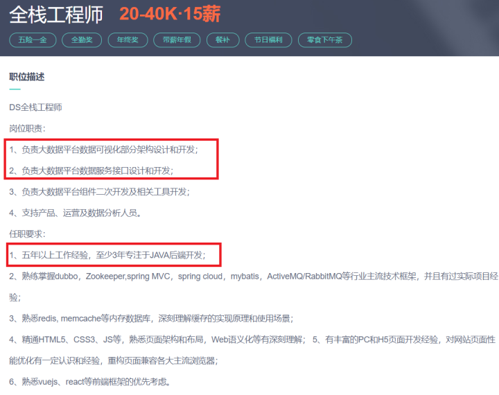

# 程序员是做全栈工程师好？还是专注一个领域好？

**但凡做全栈工程师的，要么很惨，要么很牛！**

**但凡很牛的，绝不是一开始就是做全栈的！**

全栈工程师有他的技术路线，但凡有所成就的全栈工程师，绝不是刚入门时就前后端都学的，都是一种语言深入了以后，逐渐扩展自己的知识边界，最终成为全栈工程师的。

**今天讲给你听，记得帮我点赞哦。**

## 一、全栈工程师的职责

如果你学习编程的目的只是玩玩，那随意，想怎么学怎么学。

但凡为了求生，不以找工作为目的学习编程，都是在耍流氓！

你可以随便找个招聘网站，全栈工程师的要求绝对的呈现两个极端：

要么是小公司的，要的是一个人能全部包揽前后端的：

要么是高深的、能够连接前后端的架构设计岗

小公司招全栈的原因很简单，找个前后端都懂的，一个人就能全把活干了，省钱。他们不要求你能多精通，只要求你啥都会。

而架构设计岗，一般都是中大型公司在招，因为他们更需要一个同时精通前后端设计的同学来总览大局。必然地，这类人才是需要同时精通前后端的，这必然是极高端的人才。

显然，我们羡慕的当然是后者，架构设计岗。

## 二、全栈工程师真正路线

架构设计岗，也是在入门时就前后端同时做吗，也是从全栈工程师开始的吗？

很显然，从全栈工程师开始的必然结果，只能去小公司，一个人顶俩。在这样的公司，你想前后端同时练？呵呵……

而正确的路径是先从一种语言入手，比如你更喜欢前端，你就先学前端，并且以它为吃饭的本领，当你在这个领域祭奠了几年以后，对前端技术基本精通以后，再扩大自己的知识广度，通过自学或转岗的策略去深入后端技术的学习。

当你前后端技术都精通了以后，这才是全栈架构师的水平。

所以，**最关键的是，先入门一种语言，并深入。**

**什么都会点，什么都不通？**

这样找工作是极吃亏的，要么就是上面的那种做苦力的“全栈工程师”

要么也只是从事一种语言的开发工作，而由于自己在这方向能力不行，根本要不上价！

所以，聪明的同学，都是以一种语言开始深入并精通，以使自己在这个领域能站稳脚跟，有口饭吃。再考虑其它。

## 三、我想做产品怎么办

那个同学，一直在跟我强调的一点是：“我想自己做产品，我找不到人帮我做后台，我只能自己前端、后台自己弄”

没错，但凡想做产品的，前台、后台都是需要自己开发的。

我主要做Android，但我也会PHP，H5，当年为了学习网页技术学习html,jquery,ajax……学了半年多。

为的就是做产品，做APP，做小程序，做H5页面，我都做过。、

可我都没做成

但我是全栈工程师吗？

不是，我自己的方向一直是Android开发，其它的技术，用到的时候学一下，能达到目的即可。

我不会像Android一样，去了解他们的源码，优化代码架构，完全仅限于能实现我想要的功能即可。如果通过百度搜出来一段源码能直接用，那我就直接用，只要不出问题，我是绝不会去研究他的实现原理的。

**术业有专攻！**

**大家千万不要为光芒迷惑的双眼，全栈工程师也是从一个普通的程序员开始的，而不是一开始就是从事“全栈工程师”职业的。** 

我是启舰，我们下篇文章见。

## 本人所有文章皆为原创，著作权归 启舰 所有，未经授权，转载必究