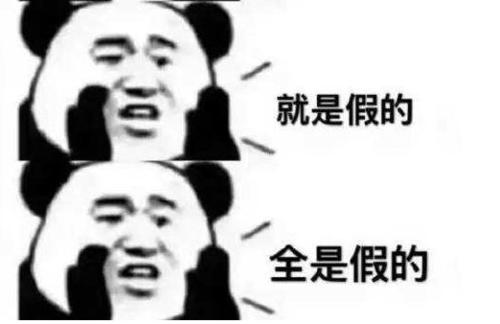

这一部分包含大学生的技术方向选择、路线规划、如何做好大学四年、是否考研及如何考研等问题。

希望通过这部分内容，给刚入学的大学生和即将毕业的同学们，都能对自己的大学有个清楚的认识。

很多高中老师说，你们努力三年，到了大学就可以随便玩了。

这是不对的！

**其实，大学是人生最重要的阶段！** 

如果你真的像老师讲的那样玩了四年，等你到了大三参加校招的时候，就知道什么是后悔了。

太多的同学，在大学阶段什么都没学会。到了毕业，实在没办法，花几万块去培训，勉强就业。

殊不知，虽然通过培训虽然进了程序员这个行业。

**但错过的校招，却是人生命运改变的节点。**

别人通过校招进了大厂，拿着傲人的工资。

而你？错过校招去培训，而就业则只能通过社招。想以应届生身份通过社招进大厂？

通过这部分内容，我将告诉你大学四年应该怎么过，才真的有意义。

**学习好固然重要，你并不是学习好就能找到好工作的！**

我不希望看到大家到毕业时再后悔莫急。

如果你现在刚大一，我特别的羡慕你。你在这么早就看到了这部分内容。如果当年我在大学时，有人跟我讲这些，我想我的人生或许会不一样。

如果你即将毕业，不要害怕。任何时候，只要努力，都不晚，有关社招的部分也会讲到，如果就业不好，没关系，都有方法弥补。

我在写这部分内容时，内心充满对大家的羡慕，大学是人生最美好的阶段，请大家珍惜它。

珍惜你的舍友吧，他们将是你人生道路上永远的好朋友。

记住你懵懂初恋、怯怯懦懦的感觉吧，以后再也不会有了

珍惜勇敢向你表白的男孩子/女孩子吧，因为他们是真的喜欢你这个人，而不是因为其它因素。

**每个人的大学都是绚丽多彩的，希望你的大学无悔，人生无憾！**