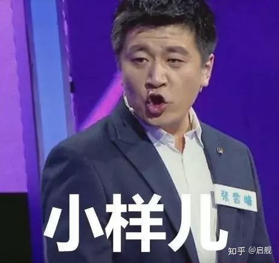
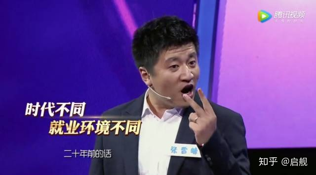
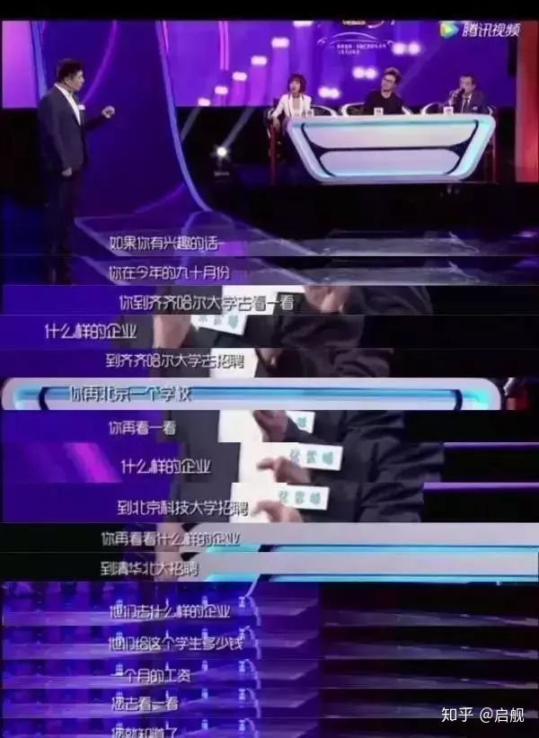

# 对计算机专业来说学历真的重要吗？

这是我19年写的一篇文章，在各个平台都成为爆文，在知乎8000多赞，在CSDN有60多万浏览。

**这篇文章很长，但绝对是精华，相信我，读完以后，你会知道学历不好的解决方案**

### 先说结论，无论赞不赞同，它本质就是这样：对于技术类工作而言，学历五年以内非常重要，但有办法弥补。五年以后，不重要。

目录：

- 张雪峰讲述的事实
- 我看到的事实
- 为什么会这样
- 非一流毕业生校招怎么办
- 非一流毕业生社招怎么办

## 一、张雪峰讲述的事实

腾讯娱乐的《演说家》节目播出后，“教育界的相声家”张雪峰老师又双叒上热搜了。

只不过这次不是讲段子，而是针对考研和学历问题和节目嘉宾“怼”了起来···

**张雪峰认为，考研是一种提升改变的机会**

**一辩 局座张召忠**

在张雪峰老师讲述完自己的观点之后，局座发问：“**马云、马化腾、乔布斯等都没有考研，学历并不高，怎么论证这一点呢？”**

张雪峰老师回答说：“那是二十年前的事情了，**时代不同，环境不同了。**再者，乔布斯本身是从常青藤名校退学的，**你要先达到名校这个高度**，而在中国要考名校是很难的。”

考了名校还不读？河南、山东考生听了想打人......

**二答 鲁豫**

鲁豫问张雪峰老师：**你是因为真的相信考研会改变一些人的人生还是因为自己做这行所以才这么说？**

张雪峰老师连续说了三遍：我是真的相信！还举了一个老家齐齐哈尔大学的例子。

我们进入社会后发现，几乎所有的大企业，都在告诉我们：学历不重要，能力更重要。

但是，500强的企业只会去那些一流的大学招聘，而不会去一些二三流的大学！有些企业甚至在招聘信息上直接注明要求985、211院校毕业。

理想很美好，现实却很骨感。正如张雪峰老师所说：**学历不重要，是500强公司最大的谎言！**

**一辩 局座张召忠**

**三怼 马丁**

整个节目的爆点就在张雪峰老师与马丁的互怼之间，这反应，这口才，也是没sei了 ......

节目播出之后，立刻引起网友热议，局面却是一边倒的站在了张雪峰老师这边。

@RNQJ666：什么时候学历都是重要的？到社会工作才深刻理解书到用时方恨少。

@蜗詹： 你总是嘲笑我念书没用，我却永远不会嘲笑你没念过什么书，这就是差别。

@甜瓜uu：升学，升的不只是学历，还有圈子，层次。

@大气庄重的我：作为一个上市七年，成员基本211起的公司的hr ，我表示，能力是最关键的，但没有学历你的机会和机遇就比别人少了太多。

马丁拿自己公司的员工的学历背景来论证学历不重要，本身就是一道伪命题。

因为作为老板的马丁本人就不是低学历者，还是上的名牌大学，他是青年政治学院的毕业生，这可不是一般人可以考上。据学校官网介绍，这所学校是在1948年创建的中央团校基础上于1985年12月命名组建的，是共青团中央直属的唯一一所普通高等学校。（根正苗红，一点儿都不普通好伐~）

而且，马丁毕业后，曾在清华大学人文学院做过讲师，这又是什么概念？正是青年政治学院的学历背景，才为马丁提供了在清华教书的基本学历保障。

过硬学历的拥有者，享受了学历带来的种种优厚待遇，还做了那些非211、985毕业的员工的老板，现在却告诉你，学历不重要，这本身不就是一道伪命题么？

有些人会说，我学历就是很低，但是我一样成功了。首先，每个人对成功的定义不一样；其次，有些人的成功是不可复制的；再者，获得成功的过程一定离不开学习，世上没有不劳而获的成功，只是学习的方向和方式不一样而已。

节目中，张雪峰老师还拿网络直播界红人MC天佑作为一个例子，他的人生很励志，从一个卖烤串的成为一名人气MC，按照我们现在对成功的一般定义，他是成功的，但是有几个普通人可以做到像MC天佑现在这样，人们在鼓吹无学历也能成功时，忘了它还有一个大bug——比例问题啊。

## 二、我看到的事实

### 1、二本毕业后

因为是广西的渣渣二本，XX学院(我就不提了，以免伤到校友)。我们同学毕业后，大部分同学啥都没学会。想继续从事计算机的，花了三四万，去参加培训。更多的同学是直接转行。

校招？根本没有校招好吗！去我们学校校招的都是些工厂招工的，你会去？

没办法，硬着头皮去广州找工作，2011年，一个月2500！一个学计算机的，还没工厂流水线挣的多！这就是现实，而且非常难找，只能进些创业公司，稍大一点的，没实战经验，没实习经历，又是个渣渣二本，根本没人要！

有人会说，是不是你能力不行啊？是的，相比别人，我可能能力不行。但相比我的同学，我可是他们中最优秀的，我连续三年得国家励志奖学金。每年的学校一等奖学金都会有我的。我虽然没有实习经历，但我大三就开始学软件开发，我自己开发的桌面软件有四款。（后来考研，教授就是看重我的实战能力才招我的）

我跟我另一个同学，走了完全不同的道路。我看清了之后，我考研去了。他仍然坚持技术改变命运。结果是，在北京打拼的八年，去年去面试阿里，进了面试，仍被刷了。

这就是事实！！！血的事实！！！

### 2、研究生后的生活

我考研报考的是中国科学院，2011年中科院大部分的研究所的分数线都是315，只有软件所和计算所的分数特别高，我报考的软件所分数张是343，而我恰恰考了342！差一分进不了面试，只能中科院内其它所调剂。申请调剂了无数次，一回回给各个所的招生老师打电话，最终等来的是一句句的：**我们只接受985/211学校的同学调剂，虽然你分数比较高，但不满足硬性要求。**

这就是事实！！！

经过曲折的调剂过程，我最终进了中国海洋大学。这个学校是他们眼中的985/211

人生得到了完全的改变！！！！

在研究生过程中，接触和负责的项目无数，动不动就是国家级的，虽然你自己觉得没什么技术含量，但头衔拿出来就是鲜亮！！！

因为有了本科毕业时的经验，所以，我读研过程中，我非常勤奋。努力增强自己的技术水平。

有了学校和技术能力的加持。在毕业校招时，在所有同学前，第一个进了阿里。

另外，我想说的是，我的同学们的情况，我们整个计算机学院的研究生84个人。全部都是进的一线计算机公司，百度、腾讯、阿里巴巴、360、华为、美团等，有些不太想走技术路线的，进的也都是银行总部等核心单位。

这就是事实！！！我眼中的事实！！！！

**鼓吹学历不重要的，都是扯淡！！！！**

### 3、工作后的看到的事实

**工作几年后，做了校招、社招的面试官，知道了一些行业秘密，这里告诉你**

**校招：**

在通知你笔试前，会有简历筛选环节，校招筛选简历系统中，如果你的学校，不在它筛选范围内，那你的简历是被直接丢弃的。

**社招：**

**对于已经有了工作经验的，学历就显得不那么重要，因为工作经验和技术水平可以弥补。在社招时，所有的简历是HR先过，觉得可以了才会给部门负责人。**

一般的公司都有硬性要求，非一本或非985/211的学生，五年以内工作经验的（有的是三年），直接筛掉，根本不会走到部门负责人那里。

每个大公司看重学历的程度都不同，像阿里巴巴，就不是特别看重。注意，不是特别看重，不等于不看重，等会跟你说什么是特别看重。在阿里，也有二本的同学，也在普通本科的同学。好像给人一种不看重学历的样子。我曾经单独去问过一个二本的同学，人家全国ACM竞赛第三名！！！普通本科进来的，很多都是通过实习转正的，根本不是通过校招！

而什么是特别看重呢？我曾经给一个公司内推一个同学，他在阿里工作了两年，武汉科技大学的。能进阿里，肯定能力挺强，但被HR拒了，因为是，他们公司的招聘要求是：五年以内的，非985/211不要，五年以后的可以放开。

**与HR的对决：**

后来，我专门咨询过HR，为什么会有这种筛选，学校并不能代表个人啊，学校不好，但并不表示人家能力都不行啊，总归有好的啊。谁又能保证，清华北大里没渣渣？

结果，我被diss的很惨。他说，你让我校招去二本学校？一类学校的学生都还招不完，我为什么要去二本学校！！！二本学校的学生不可否认地有人才，但你知道我劳师动众地把那么多的面试专家、项目主管搬过去校招，通过率我怎么保证？我敢这么说，只要今年我校招去了二本学校，来年我就得滚蛋！

发现这个HR太难沟通了，我就换了个HR，问问社招的事情。

问题是：为什么社招仍然有学校的限制，比如三年以内需要是985/211的？

HR回：其实，不光我们这么限制，在大公司的HR界都有普遍的认同。因为社招HR给项目主管简历，并不是HR本身的意愿。我也是非211学校出身，所以，我并不会有任何的歧视。之前，我也曾把二本、专科的同学的简历发给项目主管。结果面试通过率非常的低。你想想，一个主管，每天那么多事，年薪一两百万，天天跑去面试，每次面试必须满一小时（公司规定），结果凤毛麟角的通过率。结果，我被投诉了。差点丢了饭碗。**所以，任何的规则，都是有原因的。**

## 三、非一流校招同学怎么办

前面提到，非一流校招，会经过校招系统筛选，大概率是收不到笔试通知的。

## 没关系，霸笔！！！霸面！！！！走起来！！！

参加霸笔、霸面，最重要的目的，是把自己的简历给到面试官，能让他们眼前一亮的机会。所以，最关键的是如何让他们眼前一亮！！！

## 敲黑板！！！在校招开始前，面试眼前一亮三步准备：参加竞赛、参加实习、增加项目经验

**1、参加竞赛：**

在大学期间，有很多的算法竞赛、ACM竞赛，尽量参加全国性的，有含金量的比赛，这才能眼前一亮。

**2、参加实习**

去大公司实习，相比校招进入大公司，那是简单很多，二本学校的学生，也能进得去实习。而且在大公司都有实习生转正的机会，我所待过的公司，只要你去实习了，表现的不错，基本上100%转正。

即便进不去大公司实习，在校招时，有实习经历，也会是简历上很重要的一项。而且一般有实习经历，就会有项目经验，这真是一举两得。

**3、增加项目经验**

如果实在没时间实习，或者实习中没做什么项目的话，那怎么办呢？在简历中最重要的就是项目经验了，如何解决呢？

## 敲黑板！！！没有项目经验就造项目经验！！！！

现在网上那么多的实战教程、github上遍地的源码分享，都可以为你所用。

在面试时，这些项目经验都可以写上，最关键的是自己要弄通、弄会，尽量先仿一遍，自己再从头到尾自己再写一遍，把所有涉及到的知识点都弄通弄会。面试的时候，就实话实说，就说你自己仿的，没有关系，做为面试官，我们更看重的是你会啥并且你是不是真的会。

总是有同学问我有没有什么资料推荐学习，索性全网大搜罗了一下，用时一个多月。帮大家搜集了3T的资源，包括计算机专业46个方向入门、进阶、实战的视频和电子书都有，有的都是靠买的，视频、资料、源码都有，大家可以去学习。

尤其对于初入门的同学，我推荐大家跟着视频学，这里的很多视频都是培训班面向就业的，从零基础开始，不用考虑学习路线的问题，学完就达到了就业水平。

**扫描下方二维码，回复『211』，即可获取**。没有任何套路，大家放心下载

## 四、非一流社招同学怎么办

社招同学其实是有优势的，因为在已经有工作经验的情况下，学历并不是那么重要的，起码不像校招时，直接机筛就给筛掉了，社招同学可以有以下途径来进入大公司。

## 1、混圈子、混人脉、靠内推

你知道六人定律吗？就是说想认识世界上的任何一个人，最多通过六个人的桥接就可以认识！！

这就是圈子和人脉的重要性，你有同学、朋友、同事，他们任何一个人进了大公司，都可以内推你，而且在内推时，是可以直接跳过HR，直接把简历给他们主管的。

凡做过主管的都会有经验，不看僧面看佛面，也会给你个面试机会，会让你过来聊聊，不然，他没办法给内推你的人交待！

所以，跟同学、朋友、同事处好关系，用得着！

## 2、靠猎头

如果目前你还没有那些人脉，没关系，也有方案，去找猎头，猎头很好找，简历发到猎聘网，就会有猎头找你了。

虽然猎头会跟很多大公司有合作关系，也自然能把你的简历推到大公司里，但这里有两点关键条件：

- 需要走正规流程，先经对应公司HR筛选，再到部门主管，无跳级可能
- 猎头看不看得上你，主要看个人简历内容，即个人实力，所以这部分还得靠自己，如何靠自己，看第三点

## 3、靠自己

其实无论走什么捷径进入面试环节，在面试时除了自己，谁也帮不了你，所以，如何把自己能力提升是非常非常重要的部分。另外，需要注意的是，在自己学习时，要有方向，**一方面要提升名气，使简历发光，一方面深入学习，要有真本事。**

**1、提升名气、使简历发光**

这部分仍然是为了能顺利进入面试做的，提升自己在行业中的名气，计算机中有三个途径能提升自己的行业名气。

**（1）、Github提交MergeRequest，自造轮子**

在所有的技术面试环节，github所提交的开源项目，是一个非常能展示实力的存在，只要你在简历上写了gitHub地址，所有的技术面试官和简历筛选官，都会去看你的代码，直接看你的技术实力。

而且它的流行程度及star量，能提升你的行业影响力，在简历上是一个非常闪光的存在。

如果恰巧，他们的项目中有你的开源组件，那恭喜你，这次基本上过了。

如果你的开源组件非常流行，那恭喜你，等着大公司来私信你吧。你将会被争抢，此时，谁还会再关心你的学历？

**（2）、写博客、写书**

坚持写博客，当他们经常能搜到你的博客时，就会公认你的影响力和技术实力，在计算机领域，很多人都是靠博客起来的，比如鸿洋、郭霖等等，包括我。你以为，他们一上来就能让出版社约稿？

都是持续产出博客，博客关注者多了，出版社觉得你写得好，才会主动找你，邀请你写书的。

写博客、写书能使你在行业有一定的地位，当他们在简历上看到你的名字时候，就会油然产生一种大牛的感觉，还在在意你的学历？

我就是写博客、写书的受益者，在我面试VIVO时，表现的并不好，因为我创业一年，Android知识从来没复习过，很多知识都遗忘了，还没来得及复习，就让我去面试了。

他们原以为，我是一个特别厉害的人物，安排三个技术专家同时面，结果，一问三不知。不过，最后，还是给了我OFFER。因为他们公认我的能力是足够的，只是时间过了太久，有所遗忘，拾起来就好了。相反，如果没有这个行业影响力，那这次铁定是挂了。

**（3）、最根本：深入学习，提升能力**

前面讲了如何提升行业影响的方法，但根本的根本，还是要提升自己的实力，因为在面试时，是要面技术的，所有的外包装都会被揭穿，深入的技术复习只能靠大家自己了。

同样的，在上面的资源里，也有很多进阶的资料和书籍，3T的资源量可不是盖的，总会有你需要的内容。

**扫描下方二维码，回复『211』，即可获取**。没有任何套路，大家放心下载

**我是启舰，愿所有的同学都能如愿去到自己想去的公司，我们下篇文章见。**

