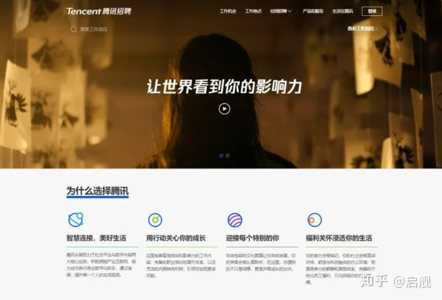

# 大学生如何靠编程赚钱？

我在读大学时，也是像你一样遍地找外包，想以项目练练手的同时赚点钱。

可有的在我把项目做完，却一直拖着不给钱。也有还没开始做，就先让交保证金。

**钱没赚着，反被坑了两千块**

**大学时代，我开过淘宝，做过项目，最后终于开窍，挣了近十万。**

**这篇文章详细讲解了通过编程确定能挣钱的几个方向，这些都是我上学时确定挣过钱的，跟着学，你也可以。**

**仔细看，如果你跟着去做了，挣不到钱的话，尽管来骂我！**

**如果你通过这篇文章挣超过到了十万（如果真的用心做，十万其实不难的），记得回来还愿哦！**

这里全都教给大家

**文字很长，内容很多，原创不易，给个star吧，宝贝们！**

目录：（括号内是我当时挣到的钱，时间久远，记不太清，大概是这些）

1. 做外包
2. 自己组团队**（一月三千）**
3. 跟第三方合作
4. 计算机二级辅导**（收入三万）**
5. 去找实习**（一月2500）**
6. 如何做毕设**（收入四万）**
7. 社会险恶，谨防被骗
8. 搞清楚自己要什么？

## 一、做外包

我把这个列在第一位。因为这应该是所有人上来就想到的策略。通过百度搜索，大家可以搜得到很多外包平台。

**但这是我最不建议的！我就是这么被坑的！**

大家也可以注册试试，但极大的可能性，根本不会有单分配给你。

当你在上面游荡几天，就会有网站运营来找你，让你充值，充值以后，推荐给你单子。

**有个网站，我充值了，推过来的单子，可我根本做不了。最后，钱没赚到，钱没了**

**这里不能明说，说了就会被投诉名誉侵权，大家自己想，09年的事，到现在还活着的是哪个？**

如果有小伙们通过这条路赚到钱的，可以留言说说方法，反正，我感觉不太靠谱。

**下面我整理了国内外能找到的的19个外包平台，如果你有兴趣（不死心……），你可以试试**

搜了快一天才找了这么多，大家点个赞可好~~~

- 程序员客栈官网：[https://www.proginn.com/](https://link.zhihu.com/?target=https%3A//www.proginn.com/)
- 码市官方网站：[https://codemart.com/](https://link.zhihu.com/?target=https%3A//codemart.com/)
- 猪八戒官网：[https://luoyang.zbj.com/](https://link.zhihu.com/?target=https%3A//luoyang.zbj.com/)
- 开源众包官网：[https://zb.oschina.net/](https://link.zhihu.com/?target=https%3A//zb.oschina.net/)
- 智城外包网官方网站：[http://www.taskcity.com/](https://link.zhihu.com/?target=http%3A//www.taskcity.com/)
- 实现网官方网站：[https://shixian.com/](https://link.zhihu.com/?target=https%3A//shixian.com/)
- 猿急送官方网站：[https://www.yuanjisong.com/](https://link.zhihu.com/?target=https%3A//www.yuanjisong.com/)
- 人人开发官方网站：[http://rrkf.com/](https://link.zhihu.com/?target=http%3A//rrkf.com/)
- 开发邦官方网站：[https://www.kaifabang.com/](https://link.zhihu.com/?target=https%3A//www.kaifabang.com/)
- 电鸭社区官方网站：[https://eleduck.com/](https://link.zhihu.com/?target=https%3A//eleduck.com/)
- 快码官方网站：[https://kuaimacode.com/](https://link.zhihu.com/?target=https%3A//kuaimacode.com/)
- 英选官方网站：[https://www.yingxuan.io/](https://link.zhihu.com/?target=https%3A//www.yingxuan.io/)
- Upwork官方网站：[https://www.upwork.com/](https://link.zhihu.com/?target=https%3A//www.upwork.com/)
- Freelancer官方网站：[https://www.freelance.com/](https://link.zhihu.com/?target=https%3A//www.freelance.com/)
- Dribbble官方网站：[https://dribbble.com/jobs](https://link.zhihu.com/?target=https%3A//dribbble.com/jobs)
- Remoteok官方网站：[https://remoteok.io/](https://link.zhihu.com/?target=https%3A//remoteok.io/)
- Toptal官方网站：[https://www.toptal.com/](https://link.zhihu.com/?target=https%3A//www.toptal.com/)
- AngelList官方网站：[https://angel.co/remote](https://link.zhihu.com/?target=https%3A//angel.co/remote)
- Topcoder官方网站：[https://www.topcoder.com](https://link.zhihu.com/?target=https%3A//www.topcoder.com)

## 二、自己组团队

**外包平台不靠谱，那就自己干！**我当时就是这么想的！

所以，我开了淘宝店，帮人做网站。

网上很多的网站模板。而很多公司做网站只是为了个门面，只是让别人知道，我们也有网站而已。

所以，他们的要求一般很低。把模板给他们看看，可以的话，谈价格、布到服务器上、网站帮他们填充资料，就可以了。

另外，如果你想长期把控他们的命脉，让他们每年都交钱。

**可以用你自己的阿里云账号给他们买空间/域名，每年收维护费**

这种活，我做了一年，一般一个网站收500/800的，很容易成交。每个月挣几千块，也够花了。

后来，因为我改做其它的了，这个活就没再做了，不过到现在也是一个很好的方向，有兴趣的可以试试。

## **这里把我当时收集的2300套建站源码分享给大家，有需要的拿去用吧。这回得star了吧~~~**

需要的小伙伴可以去下载，可以扫描下方二维码，回复『 **213** 』，即可获得。没有任何套路。

## 三、计算机二级辅导

每年学校里都会有很多非计算机的同学，想要报考计算机二级。考C语言、Java的尤其多。

**做为计算机的学生，这个机会，当然可以把握住啊。**

找几个志同道合的同学，大家一块到各个大学贴广告，发传单，找一些代理。

现在市面上的培训，都是几千上万的。咱们就走低价，一个科目一千不多吧。

周末组织大家到学校的教室里上课。

这个活我也干过，不过我是当老师，招生的事是其它同学做的，最后我们分成。

一个班五十人，都是能坐满的，我一天上三个班，上午场、下午场、晚上场

一个班三小时，连上两天

也就是那时候年轻，要是现在，早倒台了……

最后结账时，一个班给我一万，总共分了我三万块。

因为组织的同学是不透明的，也不是AA制的分钱，我也不知道他最终挣了多少钱，不过那年他买车了。我拿了三万块也挺开心的。

这个活太累了，后面他们再开，我就没再参与了。

**有钱了嘛，交了个女朋友，嘿嘿**

## 四、跟第三方合作

**如果你本身找不到活，可以考虑跟有渠道的师兄师姐合作。**

现在很多同学都是有门路的，也有些同学在大学时代都有自己的工作室了。

如果你身边有这样的学长，可以向他们靠靠近乎，参与他们当中，也是非常不错的。

前段时间，有小伙伴跟我反馈说，自己兼职被骗了。

因为我做公众号一年多了，而且我也有一些做接单的朋友，他们有时候单太多，做不完。

所以，我就组了个群，让他们做不完的单，分给我们。

做为组织者，我只是拉群，大家自行对接，我不会挣大家一分钱，刚组了一个多月，大家伙也接了几个单，我也比较有成就感。

如果你身边有这样信得过的人，也是可以加入他们的。

## 五、做毕设

**这个活，我也做过一段时间，因为我一般都是接的师兄师姐的毕设，钱少事多，来回改。而且毕设有严重的季节性，每年的12月到来年的3月份是高峰期。**

太过耗费时间，以至于这几个月除了做毕设，不会有任何的活动。

读研以后，把更多的精力都放在学习上，就没在做了。

我一直没觉得毕设的需求有多大，因为我一直认为绝大部分同学上大学应该都会好好学的，本科毕业设计本身不难，应该不会有多少人有这个需求。

直到，有个同学问我做不做毕业设计，他毕业设计交了钱，人家给了源码不再管了。

然后跟我说**，他们班一半以上的毕业设计都是买的**

我感觉我现在还在拼命的打工，主要原因就是当年没一直干毕业设计……

现在我也没时间弄了，这里教给大家怎么搞。

**1、找/买毕设**

我们绝大部分同学刚开始做是没有毕设的，怎么办？

在网上去搜，都能找得到。

缺点是，网上的资源有些是别人钓鱼用的，无论你怎么搭，总是有一两个模块总是跑不起来。

不用怀疑，这是因为他们源码里这个模块的文件给删了。如果你仔细找找，其中应该还有个word文档，告诉你加某个QQ获取完整源码……

不过搜确实是一个不要钱的路，也总能找到完整的源码

**另一条路，是收毕业设计。**

你准备个500块钱。向快要毕业的师兄师姐示个好，让他们把他们的毕业设计卖给你。反正他们已经毕业了，留着也用不着。

如果他们的源码和论文也是买的话，给他50块钱，他们会非常乐意。甚至请杯奶茶，都能搞定。。。我当年给别人做的毕设原文件就是这么来的

**等你去收毕业设计以后就会发现，现在的毕业设计分为三类：网站、小程序、Android应用**

当然也有大数据、物联网类的毕设，这类太难了……专业搞毕业设计的他们一般都不做……当然，如果你刚好会，那可以做的

**第一次做，建议你以网站为主。因为小程序、Android应用很少能够直接拿来用的，每年的毕设要求都不同，是需要手动敲代码的。**

而网站就非常简单了，每年大部分都是某某信息管理系统、宠物领养系统、等等，就这么些玩意。

毕业设计我当时没保存下来，这里没办法分享给大家了。

**不过我用时一个多月，搜集了3000多G的资源，包括计算机专业46个方向入门、进阶、实战的视频和电子书都有，有的都是靠买的，视频、资料、源码都有，大家可以去学习**

在做毕设时，基础扎实非常重要，师兄师姐提到的各种要求，能尽快的找到修改点并帮他们完成，越快的完成，就能做越多的单，挣更多的钱。

资源没任何套路，跟着学去吧，**记得帮star就好**

**扫描下方二维码，回复『 211 』，即可获取**。没有任何套路，大家放心下载

**2、接单**

每年的12月份开始，是代做毕业设计的热门时间。

做为新手，你完全可以先从本校学长开始，利用学长的资源，让他们在各个宿舍帮你发传单。一圈传单下来，至少接到十个单。

要价不要太高，但也不要太低，一般500-1000为宜。

**大家一定要注意的是，尽快结单比一个单吃个饱更重要！**

所以，我们尽量只接那些你已经有源码和毕设的，随便改吧改吧就能交货的单。

**对于那些需要自己写代码实现的，尽量不要接，性价比太低。**

一星期搞不完一个单，还挣个毛线啊…………

在熟练了以后，可以扩展到整个大学城，在其它大学招代理，跟他说怎么报价，成一个单给他分成。

**学生的圈子就那么大，而且呈现高聚集性。**

**只要你一个单做的好，而且性价比高，等着吧，很可能他们班的单子都是你的！！！**

## 六、找实习

**去实习要交钱的，都是骗子！！！骗子！！！！骗子！！！！**

无论校招还是社招，实习经历都非常重要。实习过程中，能接触到项目的话，那实打实的项目经验就出来了。对于没有实习过的同学而言，那绝对是碾压性的优势。

**而且，实习一般一天至少200是有的。**

找个编程的实习其实并不容易，但实习确实是编程变现的一条路。

### 1、找实习，无外乎三个途径：

**1)、实习平台、公众号**

一些找工作、找实习平台，可以直接去搜岗位，平台有很多，比如实习僧、应届生求职网、Boss直聘、刺猬实习、拉勾网、智联招聘、前程无忧等

**2）、企业官网/招聘专网**

各个大公司都有自己的官网，当有实习生岗位开放时，在官网上就会有对应入口。

(注：如果你拿到的是这本书的电子版，这里的超链接应该是不可点击的，可以找到开篇底部列出的github地址，找到这本书的开源版本，里面都是可点击的。而且随着我阅历的增加，github上应该会更新其它文章，电子书很难及时触达你，感谢你的支持)

比如：[阿里巴巴集团招聘](https://link.zhihu.com/?target=https%3A//job.alibaba.com/zhaopin/index.htm)

比如：**[腾讯集团](https://link.zhihu.com/?target=https%3A//careers.tencent.com)**

比如：**[百度招聘](https://link.zhihu.com/?target=https%3A//home.baidu.com/home/index/join_us)**

下面列出了常见的互联网公司招聘地址，自己去看吧。

[百度招聘](https://link.zhihu.com/?target=https%3A//talent.baidu.com/external/baidu/index.html) / [加入字节跳动-招聘](https://link.zhihu.com/?target=https%3A//job.bytedance.com/society) / [京东招聘-首页](https://link.zhihu.com/?target=http%3A//zhaopin.jd.com/home) / [小米招聘](https://link.zhihu.com/?target=http%3A//hr.xiaomi.com) /[华为](https://link.zhihu.com/?target=http%3A//career.huawei.com/reccampportal/campus4_index.html%23campus4/content.html)/ [拼多多社会招聘](https://link.zhihu.com/?target=https%3A//www.pinduoduo.com/social.html) /[VIVO](https://link.zhihu.com/?target=https%3A//hr.vivo.com/wt/vivo/web/index/CompvivoPageindex)/ [OPPO](https://link.zhihu.com/?target=https%3A//sc.hotjob.cn/wt/OPPO/web/index%3FbrandCode%3D1)/[网易社会招聘](https://link.zhihu.com/?target=https%3A//hr.163.com) / [360招聘官网](https://link.zhihu.com/?target=http%3A//hr.360.cn) / [新浪招聘](https://link.zhihu.com/?target=https%3A//career.sina.com.cn/portal/home) / [小红书招聘](https://link.zhihu.com/?target=https%3A//job.xiaohongshu.com) /[知乎- 社会招聘](https://link.zhihu.com/?target=https%3A//app.mokahr.com/apply/zhihu/3819) / [携程旅行网-招聘中心](https://link.zhihu.com/?target=http%3A//job.ctrip.com/default.aspx) / [陌陌招聘](https://link.zhihu.com/?target=https%3A//www.immomo.com/jobs) / [爱奇艺招聘-热门职位](https://link.zhihu.com/?target=http%3A//zhaopin.iqiyi.com) / [58同城招聘](https://link.zhihu.com/?target=https%3A//career.58.com/home) / [汽车之家招聘](https://link.zhihu.com/?target=https%3A//talent.autohome.com.cn) / [虎牙直播 - 社会招聘](https://link.zhihu.com/?target=http%3A//hr.huya.com) / [加入我们 - 斗鱼](https://link.zhihu.com/?target=https%3A//www.douyu.com/cms/about/jobs.html) / [欢聚时代招聘官网](https://link.zhihu.com/?target=http%3A//hr.yy.com) / [人才招聘-51job](https://link.zhihu.com/?target=https%3A//www.51job.com/bo/jobs/new_joinus.php) / [猎豹移动网申系统--首页](https://link.zhihu.com/?target=http%3A//hr.cmcm.com) / [搜狗招聘](https://link.zhihu.com/?target=http%3A//job.sogou.com) / [bilibili招聘](https://link.zhihu.com/?target=https%3A//www.bilibili.com/blackboard/join.html) / [搜狐招聘官网](https://link.zhihu.com/?target=https%3A//hr.sohu.com/wt/sohu/web/index)/ [脉脉-成就职业梦想](https://link.zhihu.com/?target=https%3A//maimai.cn/joinus) / [滴滴招聘](https://link.zhihu.com/?target=http%3A//talent.didiglobal.com) / [快手招聘](https://link.zhihu.com/?target=https%3A//zhaopin.kuaishou.cn/recruit/e/%23/official/index/) / [美团点评招聘官网](https://link.zhihu.com/?target=https%3A//zhaopin.meituan.com) / [中国平安-招聘官网](https://link.zhihu.com/?target=http%3A//talent.pingan.com/recruit/social.html) / [苏宁招聘官网](https://link.zhihu.com/?target=http%3A//careers.suning.cn/rps-web/) / [分众传媒招聘](https://link.zhihu.com/?target=https%3A//www.focusmedia.cn/join/) / [好未来招聘](https://link.zhihu.com/?target=http%3A//job.100tal.com) / [同程艺龙招聘系统](https://link.zhihu.com/?target=http%3A//job.ly.com) / [神州优车招聘系统](https://link.zhihu.com/?target=http%3A//hr.ucarinc.com) / [三七互娱招聘_三七互娱](https://link.zhihu.com/?target=http%3A//zhaopin.37.com/index.php) / [用户网络招聘](https://link.zhihu.com/?target=http%3A//career.yonyou.com) / [众安保险公司招聘信息](https://link.zhihu.com/?target=https%3A//www.zhongan.com/open/about/job) / [巨人网络招聘官网](https://link.zhihu.com/?target=http%3A//hr.ztgame.com) / [社会招聘网宿科技-全球领先的互联网基础服务平台](https://link.zhihu.com/?target=https%3A//www.wangsu.com/about/social.html) / [迅雷社会招聘](https://link.zhihu.com/?target=http%3A//hr.xunlei.com) /[贝壳找房校园招聘官网招聘系统](https://link.zhihu.com/?target=http%3A//campus.ke.com) / [房天下招聘--你会爱上fang.com](https://link.zhihu.com/?target=http%3A//job.fang.com/index.html) / [猎聘_2019秋季校园招聘信息](https://link.zhihu.com/?target=https%3A//event.liepin.com/t/1520576489280/index.html) / [勇者招募计划-有胆你就来-咪咕文化](https://link.zhihu.com/?target=http%3A//www.migu.cn/about/join.html) / [社会招聘_美图公司招聘官网](https://link.zhihu.com/?target=http%3A//hr.meitu.com) / [科大讯飞 | iFLYTEK - 用人工智能建设美好世界](https://link.zhihu.com/?target=https%3A//www.iflytek.com) / [南京途牛科技有限公司网申系统](https://link.zhihu.com/?target=http%3A//tuniu.zhiye.com) / [美柚 | 女生助手 - 加入我们](https://link.zhihu.com/?target=https%3A//www.meiyou.com/joinus/) / [丁香园最新招聘职位_丁香人才网](https://link.zhihu.com/?target=https%3A//www.jobmd.cn/company/94125.htm)
[Careers at Microsoft | Microsoft jobs](https://link.zhihu.com/?target=https%3A//careers.microsoft.com/us/en) / [招贤纳才 - Apple (中国)](https://link.zhihu.com/?target=https%3A//www.apple.com/jobs/cn/) /[Careers Center | Samsung Singapore](https://link.zhihu.com/?target=https%3A//www.samsung.com/cn/aboutsamsung/careers/careers-center/) / [Visa就职机会：Visa全球职位](https://link.zhihu.com/?target=https%3A//www.visa.com.cn/careers.html) / [台灣積體電路製造股份有限公司](https://link.zhihu.com/?target=https%3A//www.tsmc.com/chinese/careers/index.htm) / [Jobs at Intel](https://link.zhihu.com/?target=https%3A//www.intel.com/content/www/us/en/jobs/jobs-at-intel.html) / [Cisco Careers | Join the #WeAreCisco Tribe](https://link.zhihu.com/?target=https%3A//www.cisco.com/c/en/us/about/careers.html) / [IBM 如何成就你的事业巅峰 - 中国](https://link.zhihu.com/?target=https%3A//www.ibm.com/cn-zh/employment/%3Flnk%3Dmca_cnzh) / [Qualcomm招聘_高通中国招聘 | Qualcomm](https://link.zhihu.com/?target=https%3A//www.qualcomm.cn/company/careers) / [Working at Dell Careers](https://link.zhihu.com/?target=https%3A//jobs.dell.com) / [Sony China Career Portal](https://link.zhihu.com/?target=https%3A//www.sony.com.cn/careers/index.html) / [海康威视招聘](https://link.zhihu.com/?target=http%3A//hr.hikvision.com) / [DJI大疆招聘](https://link.zhihu.com/?target=https%3A//we.dji.com/zh-CN/%3Fsite%3Dbrandsite%26from%3Dfooter) / [中兴通讯全球招聘门户](https://link.zhihu.com/?target=http%3A//job.zte.com.cn) / [Vivo招聘](https://link.zhihu.com/?target=https%3A//hr.vivo.com/wt/vivo/web/index/CompvivoPageindex) / [OPPO招聘官网](https://link.zhihu.com/?target=https%3A//sc.hotjob.cn/wt/OPPO/web/index%3FbrandCode%3D1) / [珠海格力电器股份有限公司招聘系统](https://link.zhihu.com/?target=https%3A//gree.zhiye.com/home)

**3)靠内推**

如果你有一些朋友、师兄、师姐已经就业到理想公司，可以与他们联系，如果他们公司有实习岗位的话，可以让他协助你走内部推荐流程。很多公司，内推同学是免简历筛选和笔试的，可以直接进面试。当然，也有些公司是无论是否内推，流程都一致。

### 2、为什么我找不到实习？

在找工作/找实习前，把你想找的工作的对应内容，先搞搞会，起码要入了门。啥都不会的小白，找不到实习是很正常的。

我写了一篇文章：[《对计算机专业来说学历真的重要吗？》](https://zhuanlan.zhihu.com/p/84350029)火了以后，经常问我，我根据你的建议，到大三了去找实习，但根本找不着呀？怎么办？

这里告诉大家实习为什么找不着：

- 首先，就单位而言，实习生留下来的概率极低，一般实习完就完了，培养你？图啥呢？
- 其次，如果来的实习生啥都不会，得人教，得人带，干的活还问题多，与其招个实习生做业务，不如招个实习生打杂。
- 最后，学生都想做业务，不想打杂，一听过去干的活是打杂的都不愿去。

所以，**找不到实习的根本原因在于，你还是啥都不会！！！！**

就计算机专业而言，你要去找个敲代码的实习工作，首先，你做过项目吗？给你个需求，你能自己完成吗？

更多的同学，是想借着实习学一把，从零基础入个门。就这样的，能找得到实习？工作单位好不容易把你培养会了，入了门了，毕业了，走了，人家图啥呢。

所以，找工作/找实习前，先把自己技术练练好，入了门，能给人家直接干活，这样，人家才会要你！！！

**我精心整理了计算机各个方向的从入门、进阶、实战的视频课程和电子书，都是技术学习路上必备的经验，跟着视频学习是进步最快的，而且所有课程都有源码，直接跟着去学！！！**

资源没任何套路，跟着学去吧，**记得帮我点赞就好**

**扫描下方二维码，回复『 211 』，即可获取**。没有任何套路，大家放心下载

## 七、社会险恶，谨防被骗

在某个回答的下方，有个这条回答

**试问，如果是你，你会去吗？**

招大学生合伙人的？？？？

你怎么看？

说到底，只不过想白嫖罢了，不想给钱，空手套白狼。

创业，最重要的是什么？股权！为了控制股权，我当时创业的时候学了几个月的合伙人相关的知识，请教了不知道多少投资人。虽然最后，我们没干成，但从此可以看出，股权分配是创业中的重中之重。

**为了做一个项目，把股权拱手分配给一个大学生？**

咱们还在大学，说实话，即便学的再好，又能好到哪里去？

不用我说，自己肯定是知道自己几斤几两的。

**所以，跟你讲股权，不讲钱的，都是骗子！！！！**

## 八、搞清楚自己要什么

注意审题！大学生如何靠编程挣钱！

**如果重点在挣钱上，那完全没必要非要靠编程，挣钱的方法有很多。**

容易点的做家教、发传单、肯德基、送外卖等等，一些苦力活，都可以挣钱

我曾经分享过一个小伙伴通过翻译网站赚钱的经历，有英语功底的可以去看

《今年大三，兼职年入六万，方法路径分享》：https://mp.weixin.qq.com/s/pRBU7aId2ua8rCdvzg_jhw

另外，知乎好物带货，也是一个不错的选择。我有朋友，有比较好的带货经验和文字功底，做了三个月，已经能月入过五千了。

**如果你的重点是放在编程上，只是想顺带挣点钱，那上面的这些方法足够你用了。**

**好了，我是 启舰，祝愿大家都能挣大钱。**

## 本人所有文章皆为原创，著作权归 启舰  所有，未经授权，转载必究

